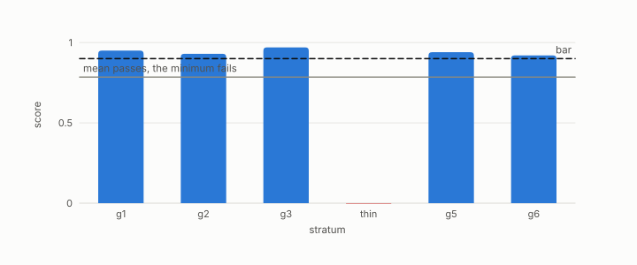

# abstention

**id.** abstention
**kind.** concept

## definition

The verdict a group receives when it has too few rows or too few queries to score. It is reported as a verdict, not dropped. Chapter 10.

**Example.** A group with 12 rows against a minimum of 50 is reported as abstained rather than scored, and the count of abstentions is printed beside the verdict.

## equation

Book equation 10.7.

    \text{verdict}=\min_{i:\ n_i\ge n_{\min},\ |Q_i|\ge q_{\min}}\ \mathrm{score}_i,\qquad \text{ABSTAIN otherwise}.

## conditions

- A stratum with too few rows or too few queries to score receives the verdict abstain, which is reported under a registered cause and excluded from the minimum. Abstain is not a pass, and when no stratum is eligible the verdict itself is abstain.
- Raising the eligibility bar can only remove strata from the minimum and so can only raise the verdict, which is why every abstention is printed beside the verdict rather than dropped.

Conditions are curated in `entries.toml` rather than read from a record.

## ledger

none

## first stated

The strata design in turboquant-pro, `turboquant-pro/docs/STRATA_RFC.md:24-98`, and chapter 10 section 10.4 of *Data Mining as Observation*.

## measurements

| Where the book states it | Numbers, as the book's sources table records them | Source |
|---|---|---|
| chapter 10 section 10.3 | abstain below 2.5 k | [`turboquant-pro/docs/HUBNESS_PRIMER.md:140-160`](https://github.com/ahb-sjsu/turboquant-pro/blob/856c4cb/docs/HUBNESS_PRIMER.md#L140-L160) |
| chapter 10 section 10.4 | area map, boundary rule, hash, refuse not warn, intra and transit counts, area classes, abstention rule | [`turboquant-pro/docs/STRATA_RFC.md:24-98`](https://github.com/ahb-sjsu/turboquant-pro/blob/856c4cb/docs/STRATA_RFC.md#L24-L98) |

## failures and corrections

none

## invariance envelope

none declared

## machine checked

[`lean/DataMiningAsObservation/Abstention.lean`](https://github.com/ahb-sjsu/observation-data-mining/blob/a0db6a8/lean/DataMiningAsObservation/Abstention.lean), theorems `abstain_not_passes`, `verdict_eq_none_iff`, `passes_verdict_iff`, `inf_le_of_subset`, at observation-data-mining a0db6a8; what the check covers is stated in the book's [appendix C](https://github.com/ahb-sjsu/observation-data-mining/blob/a0db6a8/chapters/machine_checked.md).

## used in

*Data Mining as Observation* chapters 0, 10, 11, 14.

## related

min-over-strata, anti-hub, certificate, coverage

## see also

Ledger rows that cite the entry's records without naming it: NEG-14.

Sources-table rows that share a record with the entry without naming it: chapter 10 section 10.4.

## status

Generated 2026-09-09 by `encyclopedia/generate.py`; book at observation-data-mining a0db6a8; the commit of every record is listed in the encyclopedia's provenance.
