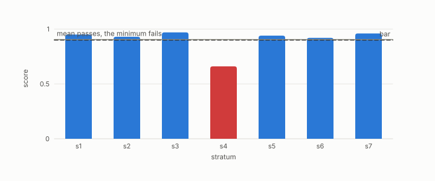

# aggregation

**id.** aggregation
**kind.** concept

## definition

Combining rows or groups into one number. An average lies between its members, and an aggregate over strata can pass a bar that one stratum fails and can reverse the sign every group shows. Chapter 2 section 2.7 and chapter 10 section 10.4.

**Example.** Strata scoring 0.95, 0.93, 0.97, and 0.66 average 0.878 and pass a bar of 0.85, while the minimum, 0.66, fails it.

## equation

Book equation 10.7.

    \text{verdict}=\min_{i:\ n_i\ge n_{\min},\ |Q_i|\ge q_{\min}}\ \mathrm{score}_i,\qquad \text{ABSTAIN otherwise}.

## conditions

- Combining rows or groups into one number, a mean, a sum, or a rate. An average lies between the smallest and largest member, a weighted aggregate over strata can pass a bar while one stratum fails it, and an aggregate can reverse the sign every group shows.
- Aggregate recall barely moves while anti-hubs fail, the aggregate staleness rate describes neither reader, and the report takes the worst group and counts the groups too thin to score.

Conditions are curated in `entries.toml` rather than read from a record.

## ledger

none

## first stated

Chapter 2 section 2.7 and chapter 10 section 10.4 of *Data Mining as Observation*, with the aggregate staleness rate of chapter 13 section 13.3.

## measurements

| Where the book states it | Numbers, as the book's sources table records them | Source |
|---|---|---|
| chapter 2 section 2.7 | the aggregate staleness rate describing neither reader | chapter 13 of this book, section 13.3 |
| chapter 10 section 10.2 | anti-hubs as where compressed indexes fail first, aggregate recall barely moves | [`turboquant-pro/docs/HUBNESS_PRIMER.md:86-131`](https://github.com/ahb-sjsu/turboquant-pro/blob/856c4cb/docs/HUBNESS_PRIMER.md#L86-L131) |

## failures and corrections

none

## invariance envelope

none declared

## machine checked

[`lean/DataMiningAsObservation/Ensemble.lean`](https://github.com/ahb-sjsu/observation-data-mining/blob/f3914f0/lean/DataMiningAsObservation/Ensemble.lean), theorems `average_between`, `sq_average_le`, `average_const`, at observation-data-mining f3914f0; what the check covers is stated in the book's [appendix C](https://github.com/ahb-sjsu/observation-data-mining/blob/f3914f0/chapters/machine_checked.md).

[`lean/DataMiningAsObservation/Simpson.lean`](https://github.com/ahb-sjsu/observation-data-mining/blob/f3914f0/lean/DataMiningAsObservation/Simpson.lean), theorems `pooled_eq_weighted`, `reversal`, `no_reversal_of_equal_sizes`, at observation-data-mining f3914f0; what the check covers is stated in the book's [appendix C](https://github.com/ahb-sjsu/observation-data-mining/blob/f3914f0/chapters/machine_checked.md).

[`lean/DataMiningAsObservation/RecallAtK.lean`](https://github.com/ahb-sjsu/observation-data-mining/blob/f3914f0/lean/DataMiningAsObservation/RecallAtK.lean), theorems `recallAtK_mem_unit`, `recallAtK_eq_one_iff`, `aggregate_le_of_failing`, `aggregate_example`, at observation-data-mining f3914f0; what the check covers is stated in the book's [appendix C](https://github.com/ahb-sjsu/observation-data-mining/blob/f3914f0/chapters/machine_checked.md).

## used in

*Data Mining as Observation* chapters 2, 5, 8, 10, 11, 12, 13.

## related

min-over-strata, simpsons-paradox, stratification, anti-hub-recall, sampling

## see also

Book equations stated beside the entry's terms, not defining it: 14.5, 8.2.

Ledger rows that cite the entry's records without naming it: NEG-14, GO-B-Llama, GO-B-Llama-rematch.

Sources-table rows that share a record with the entry without naming it: chapter 10 section 10.4, chapter 11 section 11.6.

## status

Generated 2026-09-12 by `encyclopedia/generate.py`; book at observation-data-mining f3914f0; the commit of every record is listed in the encyclopedia's provenance.
