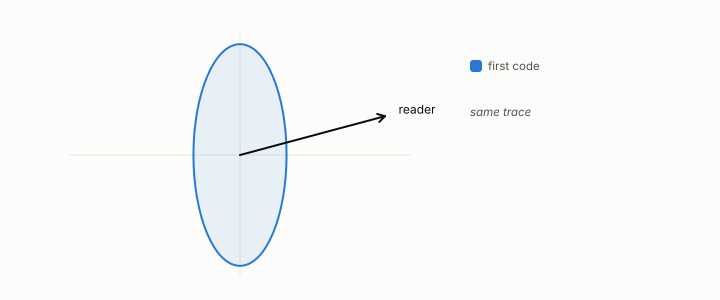

# alignment

**id.** alignment
**kind.** concept

## definition

The normalized overlap between a consumer's average read operator and the covariance of the data on the read subspace, written kappa, between zero and one. Near one the read subspace and the high-variance subspace coincide and no flip is possible. Chapter 4, equation 4.6.

**Example.** A read operator that lies wholly in one direction and a covariance with half its variance in that direction have alignment one half.

## equation

Book equation 4.6.

    \kappa=\operatorname{tr}\big(\bar P_C\,\bar\Sigma_x\big)\in[0,1],\qquad \kappa\to1\ \text{is the coupling null (no flip)}.

## conditions

- Defined as the normalized overlap between the averaged read operator and the source covariance on the read subspace, between zero and one, and so a statement about one workload.
- The alignment law that relates it to the size of the flip is a retrospective fit with a single prospective point and is carried as exploratory, not as a theorem.

Conditions are curated in `entries.toml` rather than read from a record.

## ledger

none

## first stated

Volume 14, chapter 12, `geometric-observation/chapters/ch12_failure_taxonomy_and_kappa.md:56-82`, DOI 10.5281/zenodo.21776291, where the alignment law is a retrospective fit carried as exploratory with one prospective point.

## measurements

| Where the book states it | Numbers, as the book's sources table records them | Source |
|---|---|---|
| chapter 4 section 4.4 | alignment law, retrospective fit exploratory, one prospective point | [`geometric-observation/chapters/ch12_failure_taxonomy_and_kappa.md:56-82`](https://github.com/ahb-sjsu/geometric-observation/blob/aec4c97/chapters/ch12_failure_taxonomy_and_kappa.md#L56-L82) |

## failures and corrections

none

## invariance envelope

none declared

## machine checked

[`lean/DataMiningAsObservation/Alignment.lean`](https://github.com/ahb-sjsu/observation-data-mining/blob/95af30c/lean/DataMiningAsObservation/Alignment.lean), theorems `overlap_sq_le`, `alignment_le_one`, `alignment_nonneg`, `alignment_eq_one_of_proportional`, `coupling_null`, at observation-data-mining 95af30c; what the check covers is stated in the book's [appendix C](https://github.com/ahb-sjsu/observation-data-mining/blob/95af30c/chapters/machine_checked.md).

## used in

*Data Mining as Observation* chapters 2, 4, 7, 11, 14.

## related

flip, read-distortion, coupling-null, water-filling

## see also

Ledger rows that cite the entry's records without naming it: GO-4.

Sources-table rows that share a record with the entry without naming it: chapter 4 section 4.4.

## status

Generated 2026-09-09 by `encyclopedia/generate.py`; book at observation-data-mining 95af30c; the commit of every record is listed in the encyclopedia's provenance.
