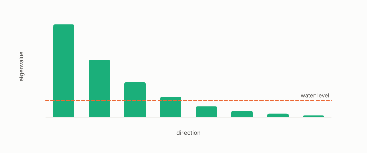

# allocation

**id.** allocation
**kind.** instrument

## definition

The assignment of a bit budget across directions. Water-filling gives directions below the water no bits, and the allocation report warns below effective rank two. Chapter 4 section 4.2.

**Example.** With directions of variance 4, 1, and 0.1 and a water level of 0.5, the first two directions get bits and the third gets none.

## equation

none

## conditions

- The assignment of a bit budget across directions. Water-filling gives directions below the water no bits, the allocation report states its gain over uniform and warns below effective rank two, and a spectrum with half its mass in one direction has effective rank at most four.
- The fragile-first allocation read 0.7118 against 0.7251 and was redesigned, and the budget inversion of GO-4 shows an allocation at fixed m rising while the matched-m allocation collapses.

Conditions are curated in `entries.toml` rather than read from a record.

## ledger

none

## first stated

Chapter 4 section 4.2 of *Data Mining as Observation*, with the allocation report in `turboquant-pro/turboquant_pro/read_allocation.py:244-307`.

## measurements

| Where the book states it | Numbers, as the book's sources table records them | Source |
|---|---|---|
| chapter 4 section 4.2 | allocation report, gain over uniform, concentration caution below effective rank 2 | [`turboquant-pro/turboquant_pro/read_allocation.py:244-307`](https://github.com/ahb-sjsu/turboquant-pro/blob/856c4cb/turboquant_pro/read_allocation.py#L244-L307) |
| chapter 10 section 10.5 | fragile-first allocation 0.7118 vs 0.7251, targets up 0.004 to 0.034, redesigned allocator passed | [`turboquant-pro/docs/RESULTS_strata_phase23_gates.md:110-125`](https://github.com/ahb-sjsu/turboquant-pro/blob/856c4cb/docs/RESULTS_strata_phase23_gates.md#L110-L125) |

## failures and corrections

none

## invariance envelope

none declared

## machine checked

[`lean/DataMiningAsObservation/WaterFilling.lean`](https://github.com/ahb-sjsu/observation-data-mining/blob/f3914f0/lean/DataMiningAsObservation/WaterFilling.lean), theorems `contribution_eq_water`, `terms_mul`, `two_sqrt_le`, `distortion2_ge`, `distortion2_eq_of_equal`, at observation-data-mining f3914f0; what the check covers is stated in the book's [appendix C](https://github.com/ahb-sjsu/observation-data-mining/blob/f3914f0/chapters/machine_checked.md).

[`lean/DataMiningAsObservation/EffectiveRank.lean`](https://github.com/ahb-sjsu/observation-data-mining/blob/f3914f0/lean/DataMiningAsObservation/EffectiveRank.lean), theorems `sq_sum_le`, `effRank_le`, `sum_sq_le_sq_sum`, `one_le_effRank`, `effRank_const`, `effRank_single`, at observation-data-mining f3914f0; what the check covers is stated in the book's [appendix C](https://github.com/ahb-sjsu/observation-data-mining/blob/f3914f0/chapters/machine_checked.md).

## used in

*Data Mining as Observation* chapters 0, 1, 2, 4, 10, 11.

## related

water-filling, budget, effective-rank, concentrated, bit

## see also

Book equations stated beside the entry's terms, not defining it: 4.2, 0.7, 4.6.

Ledger rows that cite the entry's records without naming it: GO-4, GO-6.

Sources-table rows that share a record with the entry without naming it: chapter 4 section 4.2.

## status

Generated 2026-09-09 by `encyclopedia/generate.py`; book at observation-data-mining f3914f0; the commit of every record is listed in the encyclopedia's provenance.
