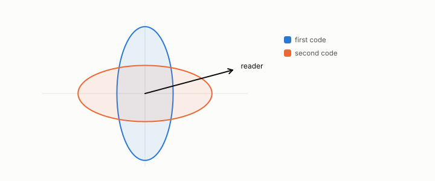

# anisotropic

**id.** anisotropic
**kind.** concept

## definition

Of a covariance, having different variances in different directions. Chapter 0.

**Example.** Covariance diag(0.3, 1.7) has variance 0.3 along the first axis and 1.7 along the second, so it is anisotropic.

## equation

none

## conditions

- Of a covariance, having different variances in different directions, which is to say unequal eigenvalues. Two readers at different angles to an anisotropic covariance read different variances, and the flip between two codes exists exactly when the covariance is anisotropic along the directions that separate them.
- Centring an embedding raised a ranker from 0.79 to 0.84 on the legal corpus, which is the condition under which a learned quotient and a variance quotient disagree most, and an isotropic control collapses the flip.

Conditions are curated in `entries.toml` rather than read from a record.

## ledger

none

## first stated

Chapter 0 section 0.4 of *Data Mining as Observation*, with the program's centring measurement in `geometric-observation/claims/LEDGER.md` row GO-B-legal and the anisotropy channel in `lebse/README.md:40-75`.

## measurements

| Where the book states it | Numbers, as the book's sources table records them | Source |
|---|---|---|
| chapter 11 section 11.8 | 0.765 to 0.971 with interval 0.190 to 0.223, 0.545 to 0.562 with interval 0.004 to 0.031, v1 0.340 with interval negative 0.214 to negative 0.081, anisotropy 0.570 to 0.259 | `lebse/README.md:40-75`; `lebse\PAPER.md:1-15,60-66`; `lebse/MODEL_CARD.md:48-52` |

## failures and corrections

none

## invariance envelope

none declared

## machine checked

[`lean/DataMiningAsObservation/Isotropy.lean`](https://github.com/ahb-sjsu/observation-data-mining/blob/f3914f0/lean/DataMiningAsObservation/Isotropy.lean), theorems `isotropic_reads_same`, `isotropic_no_flip`, `anisotropic_readers_differ`, `flip_iff_anisotropic`, at observation-data-mining f3914f0; what the check covers is stated in the book's [appendix C](https://github.com/ahb-sjsu/observation-data-mining/blob/f3914f0/chapters/machine_checked.md).

## used in

*Data Mining as Observation* chapters 0, 3, 9, 11, 12.

## related

isotropic, covariance-matrix, spectrum, whitening, flip-the

## see also

Book equations stated beside the entry's terms, not defining it: 0.5, 3.1, 4.6.

Ledger rows that cite the entry's records without naming it: GO-2 (neg. half: not reconstruction), GO-B-legal (035→036).

Sources-table rows that share a record with the entry without naming it: chapter 12 section 12.3, chapter 12 section 12.4.

## status

Generated 2026-09-10 by `encyclopedia/generate.py`; book at observation-data-mining f3914f0; the commit of every record is listed in the encyclopedia's provenance.
