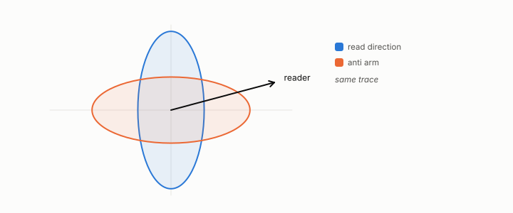

# anti arm

**id.** anti-arm
**kind.** instrument

## definition

In a flip comparison, a third code built to destroy the consumer's read subspace at the same bits. It is expected to score worst, and a comparison in which it does not is not a flip. Chapter 4.

**Example.** Put the whole error of 0.4 on the direction the reader reads and the reader sees 0.4; put it on the other direction and the reader sees zero.

## equation

Book equation 4.5.

    \text{flip}:\quad \mathrm{task}(O)>\mathrm{task}(R)\ \ \text{and}\ \ \operatorname{tr}M^{O}_\delta>\operatorname{tr}M^{R}_\delta,\qquad \mathrm{task}(\text{anti})<\mathrm{task}(R),\qquad \text{bits}(O)=\text{bits}(R).

## conditions

- The anti arm is matched on bits with the other two codes, and its purpose is to show that the read subspace is what the comparison is about, since destroying it should be worst.
- A comparison in which the anti arm is not worst has not shown a flip, whatever the other two arms did.

Conditions are curated in `entries.toml` rather than read from a record.

## ledger

none

## first stated

Volume 14, chapter 8, `geometric-observation/chapters/ch08_value.md:1-30`, DOI 10.5281/zenodo.21776291, as the third arm of every registered flip.

## measurements

none

## failures and corrections

none

## invariance envelope

none declared

## machine checked

[`lean/DataMiningAsObservation/AntiArm.lean`](https://github.com/ahb-sjsu/observation-data-mining/blob/95af30c/lean/DataMiningAsObservation/AntiArm.lean), theorems `readDiag_le_max`, `readDiag_le_total`, `anti_arm_worst`, at observation-data-mining 95af30c; what the check covers is stated in the book's [appendix C](https://github.com/ahb-sjsu/observation-data-mining/blob/95af30c/chapters/machine_checked.md).

## used in

*Data Mining as Observation* chapters 4, 6, 7, 12.

## related

flip, read-distortion, read-operator

## see also

Ledger rows that cite the entry's records without naming it: GO-2 (neg. half: not reconstruction), NEG-16 (KV serving, end-task), GO-B-whale (038), GO-B-blind (041).

Sources-table rows that share a record with the entry without naming it: chapter 1 section 1.4, chapter 2 section 2.5, chapter 4 section 4.3, chapter 4 section 4.4, chapter 6 section 6.2.

## status

Generated 2026-09-09 by `encyclopedia/generate.py`; book at observation-data-mining 95af30c; the commit of every record is listed in the encyclopedia's provenance.
