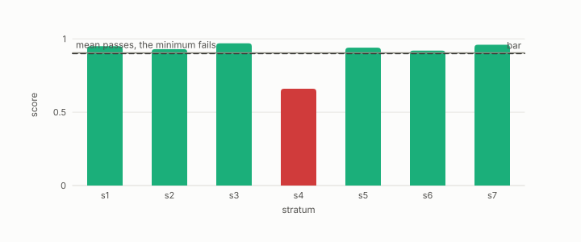

# anti-hub recall

**id.** anti-hub-recall
**kind.** instrument

## definition

Recall at k restricted to the rows that are rarely retrieved, the observer's outliers, reported as the minimum over strata so that a mean cannot hide the tail. Chapter 10.

**Example.** Seven strata of rarely retrieved rows scored between 0.62 and 0.69, so the minimum, 0.663, failed the bar of 0.90.

## equation

none

## conditions

- Recall at k restricted to the rows that are rarely retrieved, the observer's outliers, reported as the minimum over strata so that a mean cannot hide the tail. It lies in the unit interval and is one exactly when every anti-hub's true neighbours are returned.
- Compressed indexes fail on anti-hubs first while aggregate recall barely moves, and the remedy that promotes isolated rows is the remedy that compression damages first, which is why the gate is a build gate and not a report line.

Conditions are curated in `entries.toml` rather than read from a record.

## ledger

none

## first stated

Chapter 10 section 10.2 of *Data Mining as Observation*, with the program's gate in `turboquant-pro/docs/HUBNESS_PRIMER.md:86-131` and the strata result in `turboquant-pro/docs/RESULTS_strata_phase23_gates.md`.

## measurements

| Where the book states it | Numbers, as the book's sources table records them | Source |
|---|---|---|
| chapter 11 section 11.6 | anti-hub recall, p05, hub-rank correlation, hub-set overlap, the build gate | [`turboquant-pro/docs/HUBNESS_PRIMER.md:86-131`](https://github.com/ahb-sjsu/turboquant-pro/blob/856c4cb/docs/HUBNESS_PRIMER.md#L86-L131) |

## failures and corrections

none

## invariance envelope

none declared

## machine checked

[`lean/DataMiningAsObservation/RecallAtK.lean`](https://github.com/ahb-sjsu/observation-data-mining/blob/95af30c/lean/DataMiningAsObservation/RecallAtK.lean), theorems `recallAtK_mem_unit`, `recallAtK_eq_one_iff`, `aggregate_le_of_failing`, `aggregate_example`, at observation-data-mining 95af30c; what the check covers is stated in the book's [appendix C](https://github.com/ahb-sjsu/observation-data-mining/blob/95af30c/chapters/machine_checked.md).

[`lean/DataMiningAsObservation/Hubness.lean`](https://github.com/ahb-sjsu/observation-data-mining/blob/95af30c/lean/DataMiningAsObservation/Hubness.lean), theorems `sum_count`, `sum_count_eq`, `count_congr`, `antiHub_iff`, at observation-data-mining 95af30c; what the check covers is stated in the book's [appendix C](https://github.com/ahb-sjsu/observation-data-mining/blob/95af30c/chapters/machine_checked.md).

## used in

*Data Mining as Observation* chapters 10, 11, 12.

## related

anti-hub, recall-at-k, min-over-strata, hub, stratification

## see also

Book equations stated beside the entry's terms, not defining it: 10.7, 11.3, 0.35.

Ledger rows that cite the entry's records without naming it: NEG-14.

Sources-table rows that share a record with the entry without naming it: chapter 10 section 10.2, chapter 10 section 10.4, chapter 10 section 10.5, chapter 12 section 12.4.

## status

Generated 2026-09-09 by `encyclopedia/generate.py`; book at observation-data-mining 95af30c; the commit of every record is listed in the encyclopedia's provenance.
