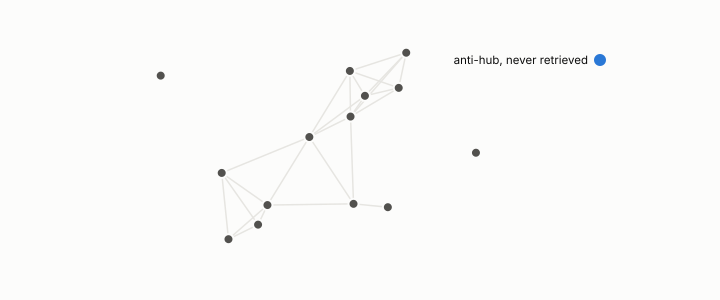

# anti-hub

**id.** anti-hub
**kind.** concept

## definition

A row that is never or almost never retrieved as anyone's nearest neighbour. Chapter 10 names five kinds and shows one is manufactured by the query budget. Chapters 3 and 10.

**Example.** With 1000 queries at k equal to 10 there are 10000 slots, so in a corpus of 100000 rows at least 90 percent are never retrieved.

## equation

Book equation 10.3.

    N_k(x\mid Q)=\big|\{q\in Q:\ x\in\operatorname{top}_k(q)\}\big|,\qquad \text{anti-hub}:\ N_k(x)=0.

## conditions

- An anti-hub is a row no query retrieves, and chapter 10 names five kinds, of which one is manufactured by the query budget rather than by the corpus.
- Anti-hubs are where compressed indexes fail first, since quantization rounds away the fine distinctions by which they are found, while aggregate recall barely moves, which is why recall is reported per stratum with the anti-hub stratum named.

Conditions are curated in `entries.toml` rather than read from a record.

## ledger

none

## first stated

Radovanović, Nanopoulos, and Ivanović, hubs in space, 2010, as chapter 3 cites it, with the program's five kinds in turboquant-pro, `turboquant-pro/docs/HUBNESS_PRIMER.md:86-131`, and chapter 10 section 10.2 of *Data Mining as Observation*.

## measurements

| Where the book states it | Numbers, as the book's sources table records them | Source |
|---|---|---|
| chapter 10 section 10.2 | anti-hubs as where compressed indexes fail first, aggregate recall barely moves | [`turboquant-pro/docs/HUBNESS_PRIMER.md:86-131`](https://github.com/ahb-sjsu/turboquant-pro/blob/856c4cb/docs/HUBNESS_PRIMER.md#L86-L131) |
| chapter 11 section 11.6 | count of ten, hubs and anti-hubs, max 78 vs 369, density correlation about 0.67, 8 percent vs 34 percent, abstain below 2.5k, centering vs mutual-proximity rescaling | `turboquant-pro\docs\HUBNESS_PRIMER.md:1-60,60-170` |
| chapter 11 section 11.6 | anti-hub recall, p05, hub-rank correlation, hub-set overlap, the build gate | [`turboquant-pro/docs/HUBNESS_PRIMER.md:86-131`](https://github.com/ahb-sjsu/turboquant-pro/blob/856c4cb/docs/HUBNESS_PRIMER.md#L86-L131) |

## failures and corrections

none

## machine checked

[`lean/DataMiningAsObservation/Hubness.lean`](https://github.com/ahb-sjsu/observation-data-mining/blob/08b4794/lean/DataMiningAsObservation/Hubness.lean), theorems `sum_count`, `sum_count_eq`, `count_congr`, `antiHub_iff`, at observation-data-mining 08b4794; what the check covers is stated in the book's [appendix C](https://github.com/ahb-sjsu/observation-data-mining/blob/08b4794/chapters/machine_checked.md).

## used in

*Data Mining as Observation* chapters 3, 10, 11, 12.

## related

hubness, poisson-ceiling, min-over-strata, rank-certificate

## see also

Book equations stated beside the entry's terms, not defining it: 10.7.

Ledger rows that cite the entry's records without naming it: NEG-11, NEG-14.

Sources-table rows that share a record with the entry without naming it: chapter 3 section 3.5, chapter 8 section 8.10, chapter 10 section 10.3, chapter 10 section 10.4, chapter 10 section 10.5, chapter 11 section 11.6, chapter 12 section 12.4.

## status

Generated 2026-09-06 by `encyclopedia/generate.py`; book at observation-data-mining 08b4794; the commit of every record is listed in the encyclopedia's provenance.
