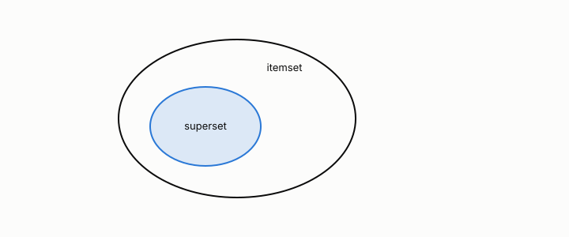

# anti-monotonicity

**id.** anti-monotonicity
**kind.** concept

## definition

The property that support cannot increase when an itemset grows, which licenses Apriori to prune every superset of an infrequent itemset without loss. Chapter 5.

## equation

none

## conditions

- The property that support cannot increase when an itemset grows, since every transaction containing the larger set contains the smaller. It licenses Apriori to prune every superset of an infrequent itemset without loss, because no frequent itemset can lie above an infrequent one.
- The license is a statement about the measure and not about the data, and the book's sidebar carries it to thresholds outside itemsets, where the analogous license is the ceiling on a score that a Youden bound supplies.

Conditions are curated in `entries.toml` rather than read from a record.

## ledger

none

## first stated

Agrawal and Srikant, fast algorithms for mining association rules, 1994, as chapter 5 section 5.3 of *Data Mining as Observation* reads it.

## measurements

none

## failures and corrections

none

## machine checked

`lean/DataMiningAsObservation/SafePruning.lean`, theorems `support_anti`, `apriori`, `subset_of_frequent`, at observation-data-mining 08b4794.

`lean/DataMiningAsObservation/ItemSet.lean`, theorems `supportFrac_mem_unit`, `supportFrac_empty`, `supportFrac_anti`, `supportFrac_union_le`, `closed_of_maximal`, at observation-data-mining 08b4794.

## used in

*Data Mining as Observation* chapters 5.

## related

apriori-principle, support, safe-pruning, itemset

## see also

Book equations stated beside the entry's terms, not defining it: 5.1, 5.3.

Sources-table rows that share a record with the entry without naming it: chapter 5 section 5.1 to 5.3, 5.5, chapter 5 section 5.3.

## status

Generated 2026-09-06 by `encyclopedia/generate.py`; book at observation-data-mining 08b4794; the commit of every record is listed in the encyclopedia's provenance.
