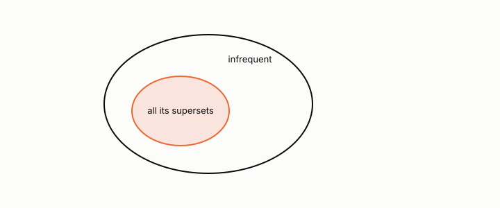

# Apriori principle

**id.** apriori
**kind.** result

## definition

The statement that every subset of a frequent itemset is frequent, the contrapositive of anti-monotonicity. Chapter 5.

**Example.** If the pair bread and jam is infrequent, every superset such as bread, jam, and milk is skipped without being counted.

## equation

Book equation 5.3.

    X\subseteq Y\ \Longrightarrow\ s(X)\ge s(Y).

Book equation 5.1.

    s(X)=\frac{\sigma(X)}{N},\qquad c(X\to Y)=\frac{\sigma(X\cup Y)}{\sigma(X)}=\frac{s(X\cup Y)}{s(X)}.

## conditions

- Support cannot increase when an itemset grows, so an infrequent itemset has only infrequent supersets and every subset of a frequent itemset is frequent. This holds for any finite collection of transactions.
- The principle licenses pruning the lattice above an infrequent itemset without counting, and the count of candidates rather than the count of transactions decides whether the run finishes.

Conditions are curated in `entries.toml` rather than read from a record.

## ledger

none

## first stated

Agrawal and Srikant, fast algorithms for mining association rules, 1994, as TSK chapter 5 presents it, and chapter 5 section 5.3 of *Data Mining as Observation*.

## measurements

| Where the book states it | Numbers, as the book's sources table records them | Source |
|---|---|---|
| chapter 5 section 5.1 to 5.3, 5.5 | support, confidence, lift, the Apriori principle, FP-growth, closed and maximal itemsets, objective measures, Simpson's paradox, cross-support | TSK 2e chapter 5 |

## failures and corrections

none

## machine checked

[`lean/DataMiningAsObservation/SafePruning.lean`](https://github.com/ahb-sjsu/observation-data-mining/blob/08b4794/lean/DataMiningAsObservation/SafePruning.lean), theorems `support_anti`, `apriori`, `subset_of_frequent`, at observation-data-mining 08b4794; what the check covers is stated in the book's [appendix C](https://github.com/ahb-sjsu/observation-data-mining/blob/08b4794/chapters/machine_checked.md).

## used in

*Data Mining as Observation* chapters 5.

## related

safe-pruning, monotone-invariance

## see also

none

## status

Generated 2026-09-06 by `encyclopedia/generate.py`; book at observation-data-mining 08b4794; the commit of every record is listed in the encyclopedia's provenance.
