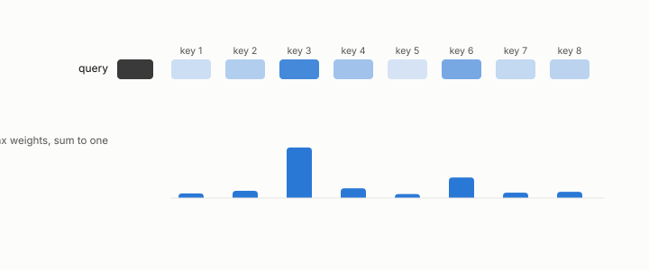

# attention

**id.** attention
**kind.** concept

## definition

The operation inside a language model that lets each token look at earlier ones by comparing its query to their keys and averaging their values. Chapter 0 section 0.11.

**Example.** Scores 2, 1, and 0 against three keys give softmax weights 0.665, 0.245, and 0.090.

## equation

Book equation 0.23.

    \operatorname{softmax}(z)_i=\frac{e^{z_i}}{\sum_j e^{z_j}},\qquad \text{output}=\sum_i\operatorname{softmax}\!\Big(\frac{q\cdot k_i}{\sqrt{d}}\Big)_{\!i}\,v_i.

## conditions

- A head weights each earlier token's value by the softmax of its query-key score and sums. For scalar values the output lies between the smallest and largest value, and the head reads the keys only through their scores against the query, so a key change the query does not read leaves the output unchanged however large it is.
- That is the head's read subspace, a few query-weighted directions of each key, and the reason a key reconstruction at cosine 0.995 raised the perplexity by three orders of magnitude.

Conditions are curated in `entries.toml` rather than read from a record.

## ledger

none

## first stated

Chapter 0 section 0.11 and chapter 11 section 11.1 of *Data Mining as Observation*, with the program's head-level measurements in `turboquant-pro/docs/KV_KEYS_FINDING.md:1-49` and the serving-stack ledger row.

## measurements

none

## failures and corrections

none

## invariance envelope

none declared

## machine checked

[`lean/DataMiningAsObservation/Attention.lean`](https://github.com/ahb-sjsu/observation-data-mining/blob/f3914f0/lean/DataMiningAsObservation/Attention.lean), theorems `output_le_max`, `min_le_output`, `output_congr`, `output_nuisance`, at observation-data-mining f3914f0; what the check covers is stated in the book's [appendix C](https://github.com/ahb-sjsu/observation-data-mining/blob/f3914f0/chapters/machine_checked.md).

## used in

*Data Mining as Observation* chapters 0, 1, 2, 4, 6, 8, 11, 13.

## related

softmax, read-subspace, nuisance, flip

## see also

Book equations stated beside the entry's terms, not defining it: 11.1.

Ledger rows that cite the entry's records without naming it: GO-2/GO-12/GO-13 operational (KV serving, 077), NEG-2.

Sources-table rows that share a record with the entry without naming it: chapter 1 section 1.4, chapter 2 section 2.5, chapter 3 section 3.2, chapter 8 section 8.2, chapter 11 section 11.1, chapter 11 section 11.2.

## status

Generated 2026-09-10 by `encyclopedia/generate.py`; book at observation-data-mining f3914f0; the commit of every record is listed in the encyclopedia's provenance.
