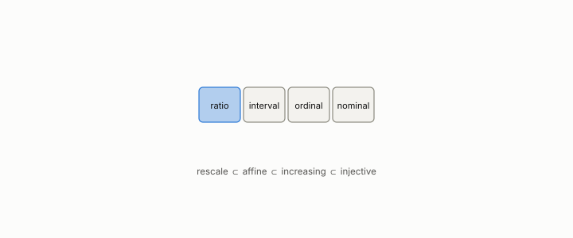

# attribute type

**id.** attribute-type
**kind.** concept

## definition

The declaration of which transformations of a column keep its meaning, any injective relabelling for nominal, a strictly increasing map for ordinal, an affine map for interval, and a positive rescaling for ratio, nested in that order. Chapter 2 section 2.1.

**Example.** Temperature in Celsius is an interval scale, so a ratio of two temperatures means nothing, while 4 metres is twice 2 metres on the ratio scale of length.

## equation

none

## conditions

- The declaration of which transformations of a column do not change its meaning. A ratio scale permits a positive rescaling, an interval scale an affine map with positive slope, an ordinal scale a strictly increasing map, and a nominal scale any injective relabelling, and the four classes are nested in that order.
- A rescaling preserves ratios and an affine map preserves ratios of differences, so a consumer that reads a ratio of two interval-scale columns reads the origin the scale said was arbitrary.

Conditions are curated in `entries.toml` rather than read from a record.

## ledger

none

## first stated

Stevens, on the theory of scales of measurement, 1946, as chapter 2 section 2.1 of *Data Mining as Observation* reads it after TSK section 2.1.

## measurements

| Where the book states it | Numbers, as the book's sources table records them | Source |
|---|---|---|
| chapter 2 section 2.1 | the four attribute types and permitted transformations | TSK 2e section 2.1 |

## failures and corrections

none

## invariance envelope

none declared

## machine checked

[`lean/DataMiningAsObservation/AttributeType.lean`](https://github.com/ahb-sjsu/observation-data-mining/blob/95af30c/lean/DataMiningAsObservation/AttributeType.lean), theorems `scale_affine`, `affine_strictMono`, `strictMono_injective`, `scale_preserves_ratio`, `affine_preserves_difference_ratio`, at observation-data-mining 95af30c; what the check covers is stated in the book's [appendix C](https://github.com/ahb-sjsu/observation-data-mining/blob/95af30c/chapters/machine_checked.md).

## used in

*Data Mining as Observation* chapters 2, 13.

## related

standardization, discretization, quotient, monotone-invariance-theorem

## see also

Book equations stated beside the entry's terms, not defining it: 2.1, 0.12a.

## status

Generated 2026-09-09 by `encyclopedia/generate.py`; book at observation-data-mining 95af30c; the commit of every record is listed in the encyclopedia's provenance.
