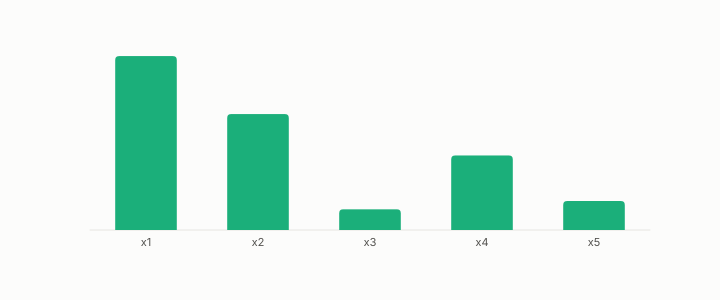

# attribution

**id.** attribution
**kind.** instrument

## definition

An assignment to each feature of a share of one prediction. The raw gradient is the sensitivity at a row, gradient times input is the share of the change in output, and the averaged squared gradient is a diagonal entry of the read operator, and the three are kept apart. Shapley, permutation, and partial-dependence methods measure other things and are named for them. Chapter 14.

**Example.** For the affine consumer 3x1 + 2x2, moving from (0, 0) to (1, 1) gives attributions 3 and 2, which sum to the change in output, 5.

## equation

none

## conditions

- An assignment to each feature of a share of one prediction. Three gradient quantities are kept apart. The raw gradient is the sensitivity at a row. Gradient times input, the sensitivity times the move along a coordinate, sums exactly to the change in output for an affine consumer and is zero on an unread coordinate. The weighted mean of the squared sensitivity is a diagonal entry of the read operator, so an averaged squared gradient estimates the read operator and a single-row attribution does not.
- Shapley, permutation, and partial-dependence methods measure other things and are named for them, and for a tree the sensitivity is zero almost everywhere, so importances that count splits are the right reading and finite differences the wrong one.

Conditions are curated in `entries.toml` rather than read from a record.

## ledger

none

## first stated

Lundberg and Lee, a unified approach to interpreting model predictions, 2017, as chapter 14 section 14.5 of *Data Mining as Observation* reads it, with the program's contraction formula in `gtc-prototype/docs/SPECTRUM_FINDINGS.md:90-99`.

## measurements

none

## failures and corrections

none

## invariance envelope

none declared

## machine checked

[`lean/DataMiningAsObservation/Attribution.lean`](https://github.com/ahb-sjsu/observation-data-mining/blob/f3914f0/lean/DataMiningAsObservation/Attribution.lean), theorems `attr_sum_affine`, `attr_unread`, `sq_sensitivity_eq_readOp_diag`, at observation-data-mining f3914f0; what the check covers is stated in the book's [appendix C](https://github.com/ahb-sjsu/observation-data-mining/blob/f3914f0/chapters/machine_checked.md).

## used in

*Data Mining as Observation* primer L, chapters 0, 8, 14.

## related

sensitivity, read-operator, finite-difference, consumer

## see also

Book equations stated beside the entry's terms, not defining it: 0.8, 0.9, 14.5.

Ledger rows that cite the entry's records without naming it: GO-1, GO-EC-3.

Sources-table rows that share a record with the entry without naming it: chapter 11 section 11.7, chapter 14 section 14.5.

## status

Generated 2026-09-09 by `encyclopedia/generate.py`; book at observation-data-mining f3914f0; the commit of every record is listed in the encyclopedia's provenance.
