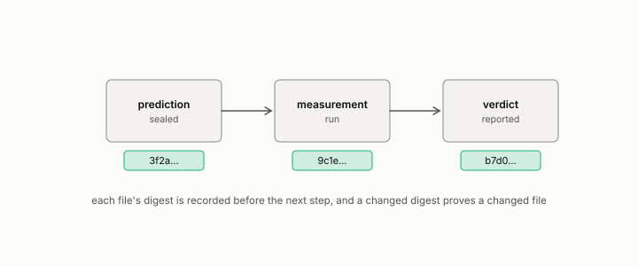

# audit

**id.** audit
**kind.** instrument

## definition

A check of a number or system against its record by a reader who did not produce it, bound to a sealed file. Chapter 8 section 8.9 and chapter 14 section 14.1.

**Example.** The audit of the measurement notes found twenty-seven errors, four of them in the checking tools themselves.

## equation

none

## conditions

- A check of a published number or system against its record, by a reader who did not produce it. An audit binds a verdict to a sealed file whose digest proves it unchanged, and a witness's disagreement with a certificate is the audit's finding.
- The audit of the measurement notes found twenty-seven errors, four in the checking tools, and the constraint-first Bell audit reached a maximum of 2.00000 across 72 configurations.

Conditions are curated in `entries.toml` rather than read from a record.

## ledger

none

## first stated

Chapter 8 section 8.9 and chapter 14 section 14.1 of *Data Mining as Observation*, with the audit binding in `xbse/README.md:195-219` and the Bell audit in `geometric-observation/articles/2026-08-03`.

## measurements

| Where the book states it | Numbers, as the book's sources table records them | Source |
|---|---|---|
| chapter 3 section 3.6 | Bell audit, max S 2.00000 across 72 configurations, d 3 to 128, correlation negative 0.036, post-selected 2.7308, controls 2.748, 2.386, 3.174, seed 20260817, sealed at 6e825d8 | [`geometric-observation/articles/2026-08-03-hubness-does-not-weaken-bell.md:1-60`](https://github.com/ahb-sjsu/geometric-observation/blob/fc6b378/articles/2026-08-03-hubness-does-not-weaken-bell.md#L1-L60); [`geometric-observation/claims/LEDGER.md`](https://github.com/ahb-sjsu/geometric-observation/blob/fc6b378/claims/LEDGER.md) row NEG-15; [`geometric-observation/results/GO-bell-geometry-audit.json`](https://github.com/ahb-sjsu/geometric-observation/blob/fc6b378/results/GO-bell-geometry-audit.json) |
| chapter 14 section 14.1 | the three questions, the trust beats, the audit binding | [`gtc-prototype/README.md:10-58`](https://github.com/ahb-sjsu/gtc-prototype/blob/c754bc5/README.md#L10-L58); `xbse/README.md:195-219` |

## failures and corrections

none

## invariance envelope

none declared

## machine checked

[`lean/DataMiningAsObservation/Seal.lean`](https://github.com/ahb-sjsu/observation-data-mining/blob/c149a10/lean/DataMiningAsObservation/Seal.lean), theorems `changed_of_hash_ne`, `hash_eq_of_eq`, `exists_collision`, at observation-data-mining c149a10; what the check covers is stated in the book's [appendix C](https://github.com/ahb-sjsu/observation-data-mining/blob/c149a10/chapters/machine_checked.md).

[`lean/DataMiningAsObservation/Certificate.lean`](https://github.com/ahb-sjsu/observation-data-mining/blob/c149a10/lean/DataMiningAsObservation/Certificate.lean), theorems `falseClear_mul_coverage`, `coverage_empty`, `falseClear_mem_unit`, `minOverStrata_passes_iff`, `minOverStrata_le_weighted_mean`, at observation-data-mining c149a10; what the check covers is stated in the book's [appendix C](https://github.com/ahb-sjsu/observation-data-mining/blob/c149a10/chapters/machine_checked.md).

## used in

*Data Mining as Observation* chapters 1, 2, 3, 4, 8, 12, 14.

## related

sealed, witness, certificate, false-clear-rate, registered

## see also

Book equations stated beside the entry's terms, not defining it: 8.1, 14.2, 13.2.

Ledger rows that cite the entry's records without naming it: NEG-15 (Bell boundary), GO-B-legal (035→036).

Sources-table rows that share a record with the entry without naming it: chapter 8 section 8.9.

## status

Generated 2026-09-09 by `encyclopedia/generate.py`; book at observation-data-mining c149a10; the commit of every record is listed in the encyclopedia's provenance.
