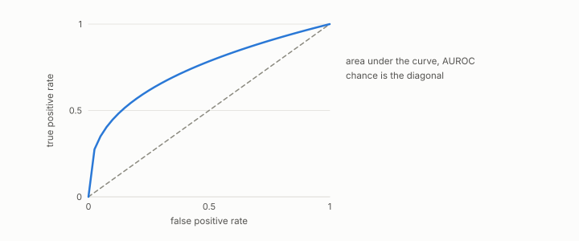

# AUROC

**id.** auroc
**kind.** concept

## definition

The area under the receiver operating characteristic curve, equal to the probability that a random positive scores above a random negative, ties counted as one half. A strictly increasing transform of the score leaves it unchanged and a strictly decreasing one sends it to one minus itself. Equation 0.16.

**Example.** Positives scoring 0.9 and 0.7 against negatives scoring 0.8 and 0.2 win three of the four pairs, so the AUROC is 0.75.

## equation

Book equation 0.16.

    \mathrm{AUROC}=\Pr\big[s^{+}>s^{-}\big]\ +\ \tfrac12\Pr\big[s^{+}=s^{-}\big].

Book equation 0.38.

    w=\max\big(0,\ 2\cdot\mathrm{AUROC}-1\big).

Book equation 12.3.

    \text{validated}\iff \mathrm{AUROC}_{\text{cross}}-\max\big(\mathrm{AUROC}_{\text{untrained}},\ \mathrm{AUROC}_{\text{BoW}}\big)\ \ge\ 0.10.

## conditions

- The area under the ROC curve, the probability that a random positive scores above a random negative with ties counted as one half. It lies in the unit interval, is one half for a constant score, one for a perfect ranking, and zero for a perfectly reversed one.
- A strictly increasing transform of the score leaves it unchanged. A strictly decreasing transform reverses every ranking and sends A to 1 minus A, so the AUROC is not free of orientation, and an authority that should ignore orientation reads the larger of A and 1 minus A.

Conditions are curated in `entries.toml` rather than read from a record.

## ledger

none

## first stated

Chapter 0 section 0.8 of *Data Mining as Observation*, the pairwise definition with ties counted one half, and the held-out AUROC of every encoder gate and flip in the program.

## measurements

none

## failures and corrections

none

## invariance envelope

none declared

## machine checked

[`lean/DataMiningAsObservation/Auroc.lean`](https://github.com/ahb-sjsu/observation-data-mining/blob/f3914f0/lean/DataMiningAsObservation/Auroc.lean), theorems `pair_nonneg`, `auroc_nonneg`, `auroc_le_one`, `auroc_perfect`, `auroc_reversed`, `auroc_chance`, `auroc_monotone_invariant`, at observation-data-mining f3914f0; what the check covers is stated in the book's [appendix C](https://github.com/ahb-sjsu/observation-data-mining/blob/f3914f0/chapters/machine_checked.md).

## used in

*Data Mining as Observation* primer S, chapters 0, 5, 6, 8, 11, 12, 14.

## related

monotone-invariance, reliability-weight, chance-level, youden-f1-bound, cross-corpus-gate

## see also

Ledger rows that cite the entry's records without naming it: GO-B-legal (035→036), GO-B-whale (038).

## status

Generated 2026-09-09 by `encyclopedia/generate.py`; book at observation-data-mining f3914f0; the commit of every record is listed in the encyclopedia's provenance.
