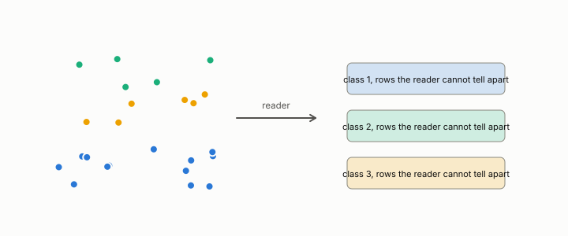

# bag of words

**id.** bag-of-words
**kind.** concept

## definition

A representation of a document as a vector with one coordinate per vocabulary term holding that term's count. Chapter 12.

**Example.** The texts 'the reader reads the row' and 'the row reads the reader' have the same counts and are one document to a bag of words.

## equation

Book equation 0.36.

    w_{t,d}=\mathrm{tf}_{t,d}\cdot\ln\frac{N}{\mathrm{df}_t},\qquad \mathrm{tf}_{t,d}=\frac{\text{count of }t\text{ in }d}{\text{length of }d},\qquad \mathrm{df}_t=\text{documents containing }t.

Book equation 12.3.

    \text{validated}\iff \mathrm{AUROC}_{\text{cross}}-\max\big(\mathrm{AUROC}_{\text{untrained}},\ \mathrm{AUROC}_{\text{BoW}}\big)\ \ge\ 0.10.

## conditions

- A document as the vector of its term counts. Two documents that are rearrangements of each other have the same bag, so the bag is a quotient that declares word order irrelevant, the counts are nonnegative, and they sum to the document's length.
- As a null model it reads only counts, and an encoder is validated only when its held-out AUROC clears the bag's by the preregistered margin. The scorecard's bag scores lie between 0.46 and 0.54, near chance.

Conditions are curated in `entries.toml` rather than read from a record.

## ledger

none

## first stated

Chapter 12 section 12.1 of *Data Mining as Observation*, with the program's bag-of-words null in `xbse/README.md:104-130` and the chapter 14 scorecard.

## measurements

none

## failures and corrections

none

## invariance envelope

none declared

## machine checked

[`lean/DataMiningAsObservation/BagOfWords.lean`](https://github.com/ahb-sjsu/observation-data-mining/blob/95af30c/lean/DataMiningAsObservation/BagOfWords.lean), theorems `bag_perm`, `bag_example`, `bag_sum`, `bag_absent`, at observation-data-mining 95af30c; what the check covers is stated in the book's [appendix C](https://github.com/ahb-sjsu/observation-data-mining/blob/95af30c/chapters/machine_checked.md).

## used in

*Data Mining as Observation* chapters 0, 12, 14.

## related

tf-idf, cross-corpus-gate, quotient, nuisance

## see also

none

## status

Generated 2026-09-09 by `encyclopedia/generate.py`; book at observation-data-mining 95af30c; the commit of every record is listed in the encyclopedia's provenance.
