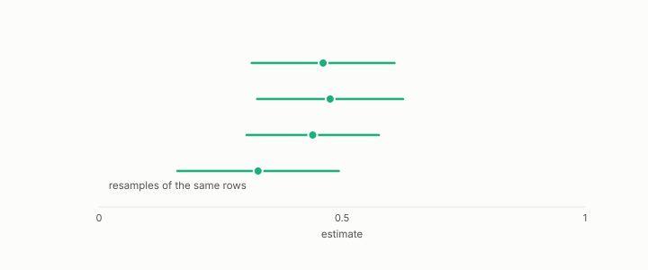

# bagging

**id.** bagging
**kind.** instrument

## definition

Fitting the same model on bootstrap resamples and averaging. The average's squared error is at most the members' mean squared error, which is how it reduces variance. Chapter 7.

**Example.** Ten trees fit on ten bootstrap resamples and averaged have at most the mean squared error of the ten members.

## equation

none

## conditions

- Fitting the same model on bootstrap resamples of the rows and averaging. The average's squared error is at most the mean of the members' squared errors, which is the arithmetic by which bagging reduces variance, and the reduction is largest when the members covary least.
- Bagging reduces variance and boosting reduces bias, and neither changes what the base model reads.

Conditions are curated in `entries.toml` rather than read from a record.

## ledger

none

## first stated

Breiman, bagging predictors, 1996, as chapter 7 section 7.1 of *Data Mining as Observation* reads it.

## measurements

| Where the book states it | Numbers, as the book's sources table records them | Source |
|---|---|---|
| chapter 7 section 7.1 | bagging variance, out-of-bag estimation, random forests, importances, AdaBoost | Hastie, Tibshirani, Friedman, ESL 2e chapters 15 and 10.1; TSK 2e 4.10 |

## failures and corrections

none

## invariance envelope

none declared

## machine checked

[`lean/DataMiningAsObservation/Ensemble.lean`](https://github.com/ahb-sjsu/observation-data-mining/blob/a0db6a8/lean/DataMiningAsObservation/Ensemble.lean), theorems `average_between`, `sq_average_le`, `average_const`, at observation-data-mining a0db6a8; what the check covers is stated in the book's [appendix C](https://github.com/ahb-sjsu/observation-data-mining/blob/a0db6a8/chapters/machine_checked.md).

[`lean/DataMiningAsObservation/Bootstrap.lean`](https://github.com/ahb-sjsu/observation-data-mining/blob/a0db6a8/lean/DataMiningAsObservation/Bootstrap.lean), theorems `mean_sub`, `var_sub`, `paired_lt_iff`, `cov_comm`, at observation-data-mining a0db6a8; what the check covers is stated in the book's [appendix C](https://github.com/ahb-sjsu/observation-data-mining/blob/a0db6a8/chapters/machine_checked.md).

## used in

*Data Mining as Observation* chapters 7.

## related

ensemble, bootstrap, random-forest, standard-error, variance

## see also

Book equations stated beside the entry's terms, not defining it: 0.18, 8.2.

## status

Generated 2026-09-09 by `encyclopedia/generate.py`; book at observation-data-mining a0db6a8; the commit of every record is listed in the encyclopedia's provenance.
