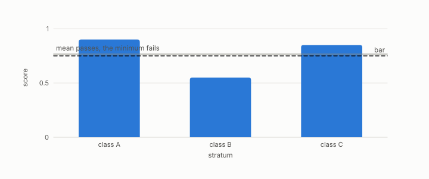

# balanced accuracy

**id.** balanced-accuracy
**kind.** concept

## definition

The mean of the per-class recalls, so that a large class cannot hide a small one. Equation 0.34.

**Example.** Recalls of 0.90 on class A and 0.30 on class B give balanced accuracy 0.60, whatever the class sizes.

## equation

Book equation 0.34.

    \mathrm{BA}=\frac1K\sum_{k=1}^{K}\frac{\text{correct in class }k}{\text{rows in class }k}.

## conditions

- The mean of the per-class recalls, between the worst class and the best. Plain accuracy is the size-weighted mean of the same recalls, so a class of 990 rows recalled perfectly and a class of 10 never recalled give accuracy 0.99 and balanced accuracy 0.5.
- The book prefers the min over classes to the mean where a verdict is at stake, since a mean can still hide one failing class among many.

Conditions are curated in `entries.toml` rather than read from a record.

## ledger

none

## first stated

Chapter 0 section 0.14 of *Data Mining as Observation*, with the program's use in the anti-hub category table, `openvector-bench/results/R13_STAGE1_RESULTS.md`.

## measurements

| Where the book states it | Numbers, as the book's sources table records them | Source |
|---|---|---|
| chapter 10 section 10.2 | five kinds, balanced accuracy 0.611, 0.718, 0.684, the category table, per-category 0.57 to 0.82, the sweep, pigeonhole floor | `openvector-bench/results/R13_STAGE1_RESULT.md:40-75` |

## failures and corrections

none

## invariance envelope

none declared

## machine checked

[`lean/DataMiningAsObservation/BalancedAccuracy.lean`](https://github.com/ahb-sjsu/observation-data-mining/blob/95af30c/lean/DataMiningAsObservation/BalancedAccuracy.lean), theorems `min_le_balanced`, `balanced_le_max`, `hidden_class`, at observation-data-mining 95af30c; what the check covers is stated in the book's [appendix C](https://github.com/ahb-sjsu/observation-data-mining/blob/95af30c/chapters/machine_checked.md).

## used in

*Data Mining as Observation* chapters 0, 10.

## related

min-over-strata, anti-hub, abstention, harness

## see also

Book equations stated beside the entry's terms, not defining it: 10.7.

Ledger rows that cite the entry's records without naming it: NEG-11.

Sources-table rows that share a record with the entry without naming it: chapter 3 section 3.5, chapter 10 section 10.2, chapter 11 section 11.6.

## status

Generated 2026-09-09 by `encyclopedia/generate.py`; book at observation-data-mining 95af30c; the commit of every record is listed in the encyclopedia's provenance.
