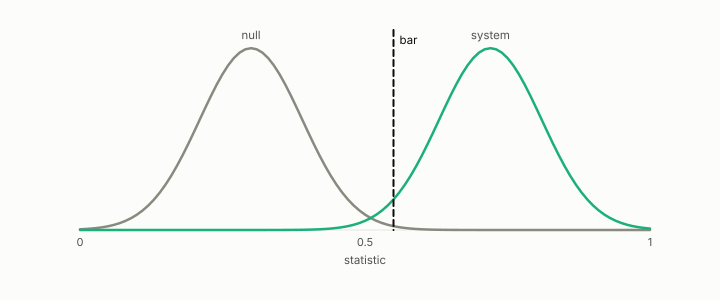

# bar

**id.** bar
**kind.** instrument

## definition

A threshold a statistic must reach, written down before the measurement. A bar discriminates only when the null fails it and the real system passes it, and a bar the null passes is vacuous. Chapter 8 section 8.3.

**Example.** A null scoring 0.30 and a system scoring 0.72 are separated by a bar at 0.55, and a bar at 0.25 is vacuous, since the null passes it.

## equation

Book equation 10.7.

    \text{verdict}=\min_{i:\ n_i\ge n_{\min},\ |Q_i|\ge q_{\min}}\ \mathrm{score}_i,\qquad \text{ABSTAIN otherwise}.

## conditions

- A threshold a statistic must reach, written down before the measurement. Passing a higher bar passes every lower one, a larger statistic passes every bar a smaller one passes, a bar discriminates exactly when it sits strictly above the null and at or below the real system, no bar discriminates when the null scores at least as high, and a bar the null passes is vacuous.
- A pass on eight cells at six parts in ten million against a bar of one in a hundred thousand was vacuous because the null cleared the bar too, which is where the anti-vacuity bar came from.

Conditions are curated in `entries.toml` rather than read from a record.

## ledger

none

## first stated

Chapter 8 section 8.3 of *Data Mining as Observation*, with the anti-vacuity bar quoted from `observation-theory-campaigns/experiments/PREREG-PF5-002.md:79-86`.

## measurements

| Where the book states it | Numbers, as the book's sources table records them | Source |
|---|---|---|
| chapter 8 section 8.3 | anti-vacuity bar, quoted | [`observation-theory-campaigns/experiments/PREREG-PF5-002.md:79-86`](https://github.com/ahb-sjsu/observation-theory-campaigns/blob/f7b7c77/experiments/PREREG-PF5-002.md#L79-L86) |
| chapter 9 section 9.2 | the battery, three new templates, frozen ratios, code hash, bars at least 10 of 12 and the dimension ordering, eccentricity scope | `the-angular-observer/PREREG_RECOGNIZER_BATTERY.md:1-80` |

## failures and corrections

none

## invariance envelope

none declared

## machine checked

[`lean/DataMiningAsObservation/Bar.lean`](https://github.com/ahb-sjsu/observation-data-mining/blob/f3914f0/lean/DataMiningAsObservation/Bar.lean), theorems `passes_anti`, `passes_mono`, `discriminates_iff`, `no_bar_of_null_ge`, `exists_bar_of_lt`, `vacuous_of_null_passes`, at observation-data-mining f3914f0; what the check covers is stated in the book's [appendix C](https://github.com/ahb-sjsu/observation-data-mining/blob/f3914f0/chapters/machine_checked.md).

## used in

*Data Mining as Observation* primer S, chapters 0, 1, 2, 3, 4, 6, 7, 8, 9, 10, 11, 12, 13, 14.

## related

gate, vacuity-threshold, null-model, preregistration, verdict

## see also

Book equations stated beside the entry's terms, not defining it: 8.3, 8.1.

Ledger rows that cite the entry's records without naming it: OT-11, NEG-14.

Sources-table rows that share a record with the entry without naming it: chapter 8 section 8.3.

## status

Generated 2026-09-10 by `encyclopedia/generate.py`; book at observation-data-mining f3914f0; the commit of every record is listed in the encyclopedia's provenance.
