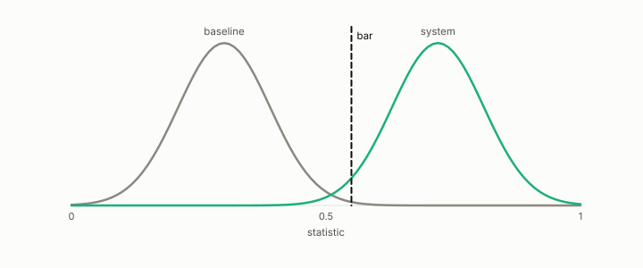

# baseline

**id.** baseline
**kind.** instrument

## definition

The simplest scorer a claim must beat under the same protocol, chance, a constant, an untrained encoder, or a single model. A score below it is a finding. Chapter 6 section 6.3 and chapter 7 section 7.4.

**Example.** An untrained encoder scored 0.50 on the rights corpus and the trained one 0.467, below the baseline.

## equation

none

## conditions

- The simplest scorer a claim must beat, chance, a constant, an untrained encoder, or a single model, run under the same protocol. A baseline that passes the bar makes the bar vacuous, and a score below the baseline is a finding.
- The rights encoder read 0.467, below the untrained baseline, and the formula's comparison with the ensemble is fair only against the single-model baseline inside one fold protocol.

Conditions are curated in `entries.toml` rather than read from a record.

## ledger

none

## first stated

Chapter 6 section 6.3 and chapter 7 section 7.4 of *Data Mining as Observation*, with the single-model baseline in `constraint-gap/review/INDETERMINATES.md:1-40`.

## measurements

| Where the book states it | Numbers, as the book's sources table records them | Source |
|---|---|---|
| chapter 8 section 8.6 | rights encoder 0.467 below untrained baseline, the AUROC lesson, cross-corpus same-sign fix | `xbse/README.md:160-172`; `xbse/experiments/rights_r6_summary.json` |

## failures and corrections

none

## invariance envelope

none declared

## machine checked

[`lean/DataMiningAsObservation/ChanceLevel.lean`](https://github.com/ahb-sjsu/observation-data-mining/blob/f3914f0/lean/DataMiningAsObservation/ChanceLevel.lean), theorems `aurocNum_const`, `auroc_const`, `weight_const`, `tau_const`, at observation-data-mining f3914f0; what the check covers is stated in the book's [appendix C](https://github.com/ahb-sjsu/observation-data-mining/blob/f3914f0/chapters/machine_checked.md).

[`lean/DataMiningAsObservation/Bar.lean`](https://github.com/ahb-sjsu/observation-data-mining/blob/f3914f0/lean/DataMiningAsObservation/Bar.lean), theorems `passes_anti`, `passes_mono`, `discriminates_iff`, `no_bar_of_null_ge`, `exists_bar_of_lt`, `vacuous_of_null_passes`, at observation-data-mining f3914f0; what the check covers is stated in the book's [appendix C](https://github.com/ahb-sjsu/observation-data-mining/blob/f3914f0/chapters/machine_checked.md).

## used in

*Data Mining as Observation* chapters 5, 6, 7, 8, 10, 11, 12, 13, 14.

## related

chance-level, null-model, bar, formula-classifier, ensemble

## see also

Book equations stated beside the entry's terms, not defining it: 8.2, 0.28, 6.2.

Ledger rows that cite the entry's records without naming it: NEG-4, GO-B-legal (035→036).

Sources-table rows that share a record with the entry without naming it: chapter 6 section 6.3, chapter 7 section 7.3, chapter 7 section 7.4.

## status

Generated 2026-09-10 by `encyclopedia/generate.py`; book at observation-data-mining f3914f0; the commit of every record is listed in the encyclopedia's provenance.
