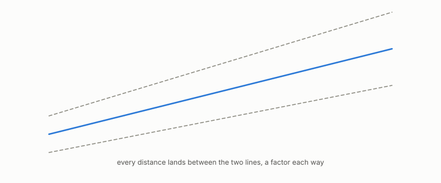

# bi-Lipschitz

**id.** bi-lipschitz
**kind.** concept

## definition

Of a map between two spaces, neither stretching nor shrinking any distance by more than a fixed factor. Equation 0.21.

**Example.** A map with factor 2 sends a distance of 1 to something between 0.5 and 2.

## equation

Book equation 0.21.

    \frac1K\,d(x,y)\ \le\ d'\big(f(x),f(y)\big)\ \le\ K\,d(x,y)\qquad\text{for all }x,y.

## conditions

- A map is bi-Lipschitz with factor K when it neither stretches nor shrinks any distance by more than K. The factor is at least one, compositions multiply the factors, and the map preserves a nearest neighbour whenever the runner-up is more than K squared times as far, the rank certificate's per-pair fact.
- It does not preserve every ordering, so it is not rank-faithful, and the program's fixed-scale uniform bi-Lipschitz claim for the commute filter is refuted and carried in the ledger.

Conditions are curated in `entries.toml` rather than read from a record.

## ledger

- *refutes or corrects.* NEG-1 `[refuted]`. Fixed-scale, uniform-in-m bi-Lipschitz for the commute filter. [`geometric-observation/claims/LEDGER.md:94`](https://github.com/ahb-sjsu/geometric-observation/blob/aec4c97/claims/LEDGER.md#L94).

## first stated

Chapter 0 section 0.10 of *Data Mining as Observation*, with the refuted uniform bi-Lipschitz claim for the commute filter in Volume 14's honest negatives, ledger row NEG-1.

## measurements

none

## failures and corrections

- NEG-1, `[refuted]`. Fixed-scale, uniform-in-m bi-Lipschitz for the commute filter. [`geometric-observation/claims/LEDGER.md:94`](https://github.com/ahb-sjsu/geometric-observation/blob/aec4c97/claims/LEDGER.md#L94).

## invariance envelope

none declared

## machine checked

[`lean/DataMiningAsObservation/BiLipschitz.lean`](https://github.com/ahb-sjsu/observation-data-mining/blob/95af30c/lean/DataMiningAsObservation/BiLipschitz.lean), theorems `one_le_factor`, `within_comp`, `nn_preserved`, `not_rank_faithful`, at observation-data-mining 95af30c; what the check covers is stated in the book's [appendix C](https://github.com/ahb-sjsu/observation-data-mining/blob/95af30c/chapters/machine_checked.md).

## used in

*Data Mining as Observation* chapters 0, 3.

## related

rank-faithful, rank-certificate, recognizer, quotient

## see also

Sources-table rows that share a record with the entry without naming it: chapter 3 section 3.2, chapter 3 section 3.3, chapter 9 section 9.1.

## status

Generated 2026-09-09 by `encyclopedia/generate.py`; book at observation-data-mining 95af30c; the commit of every record is listed in the encyclopedia's provenance.
