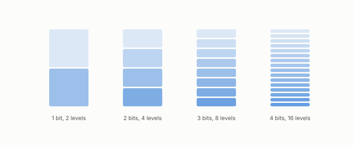

# bit

**id.** bit
**kind.** concept

## definition

The unit of a budget. A direction quantized with b bits is stored at one of two to the power b levels. Chapter 0 section 0.7.

**Example.** Four bits give 16 levels; a fifth bit gives 32, halving the step and quartering the squared error.

## equation

Book equation 0.13.

    D(b)=\sum_i s_i v_i\,4^{-b_i},\qquad b_i=\max\!\Big(0,\ \tfrac12\log_2\frac{s_i v_i}{\theta}\Big),\qquad \sum_i b_i=B.

Book equation 4.2.

    D(b)=\sum_i s_i\sigma_i^{2}\,2^{-2b_i},\qquad s_i=v_i^{\top}P_C\,v_i,\qquad b_i^{\star}=\max\!\Big(0,\ \tfrac12\log_2\frac{s_i\sigma_i^{2}}{\theta}\Big),\qquad \sum_i b_i^{\star}=B,

## conditions

- The unit of a budget. A direction quantized with b bits is stored at one of two to the b levels, so one more bit doubles the levels, halves a uniform quantizer's step, and quarters the squared error of the high-rate model, and bits add across directions since the levels multiply.
- Every flip comparison is at matched bits, since a code that spends more bits is a different budget and not a better reader.

Conditions are curated in `entries.toml` rather than read from a record.

## ledger

- *measures.* GO-7 `[replicated]`. A stored description's description rate and its conditional Landauer reset content are operationally separate resources: the same finite-$n$ code index needing $\hat R\approx0.67$ bits/symbol to describe is fully recoverable from retained … [`geometric-observation/claims/LEDGER.md:69`](https://github.com/ahb-sjsu/geometric-observation/blob/0792c84/claims/LEDGER.md#L69).

## first stated

Chapter 0 section 0.7 of *Data Mining as Observation*, with the program's matched-bits comparisons in Volume 14 and turboquant-pro.

## measurements

none

## failures and corrections

none

## invariance envelope

none declared

## machine checked

[`lean/DataMiningAsObservation/Bit.lean`](https://github.com/ahb-sjsu/observation-data-mining/blob/95af30c/lean/DataMiningAsObservation/Bit.lean), theorems `levels_succ`, `levels_add`, `step_succ`, `sqError_succ`, `sqError_antitone`, `levels_zero`, at observation-data-mining 95af30c; what the check covers is stated in the book's [appendix C](https://github.com/ahb-sjsu/observation-data-mining/blob/95af30c/chapters/machine_checked.md).

## used in

*Data Mining as Observation* chapters 0, 1, 2, 4, 6, 10, 11, 12, 13, 14.

## related

budget, water-filling, flip, landauers-principle

## see also

Ledger rows that cite the entry's records without naming it: GO-4.

## status

Generated 2026-09-08 by `encyclopedia/generate.py`; book at observation-data-mining 95af30c; the commit of every record is listed in the encyclopedia's provenance.
