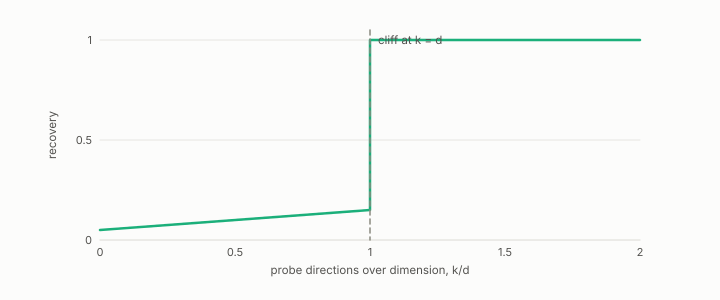

# blind probe

**id.** blind-probe
**kind.** instrument

## definition

An instrument that recovers a consumer's read operator from calls to the consumer alone, without access to its gradients or its code. Chapters 11 and 12.

**Example.** Probing a 16-dimensional consumer with 16 directions costs 32 calls and resolves the operator, and 15 directions do not.

## equation

Book equation 0.8.

    g_j\;\approx\;\frac{C(x+h\,e_j)-C(x-h\,e_j)}{2h},\qquad j=1,\dots,d.

## conditions

- The probe recovers the read operator at one operating point from calls to the consumer alone, two calls per input dimension for a central difference.
- Its budget law is a theorem for subspace-confined designs at an operating point, which is what its per-point estimators are, and does not cover allocations of calls across many operating points.
- The probe refuses when samples do not exceed the dimension and warns below a stated margin, since the identifiability miss of chapter 2 came from reading it past that point.

Conditions are curated in `entries.toml` rather than read from a record.

## ledger

- *measures.* GO-B-Llama `[predicted]`. Trained frontier LLM (Llama-3.2-3B), softmax-attention consumer — blind probe on real post-RoPE keys [`geometric-observation/claims/LEDGER.md:115`](https://github.com/ahb-sjsu/geometric-observation/blob/b2626a6/claims/LEDGER.md#L115).
- *measures.* GO-EC-3 `[predicted]`. A read operator recovered from a black-box consumer by query-only finite-difference probing, composed with the Kalman covariance as tr(P̂_C Σ), prospectively selects sensors that improve the held-out consumer at matched budgets with probe … [`geometric-observation/claims/LEDGER.md:162`](https://github.com/ahb-sjsu/geometric-observation/blob/b2626a6/claims/LEDGER.md#L162).
- *refutes or corrects.* NEG-12 `[refuted]`. (Gate B, prospective, real LLM) On a trained frontier attention layer the blind probe recovers the read operator above the sealed bar *and* projection beats reconstruction. [`geometric-observation/claims/LEDGER.md:105`](https://github.com/ahb-sjsu/geometric-observation/blob/b2626a6/claims/LEDGER.md#L105).

## first stated

readscope, the blind probe as a specified instrument, PyPI `readscope`, `readscope/PRINCIPLES.md` and `readscope/SPEC.md`, and Volume 14 chapter 10.

## measurements

none

## failures and corrections

- NEG-12, `[refuted]`. (Gate B, prospective, real LLM) On a trained frontier attention layer the blind probe recovers the read operator above the sealed bar *and* projection beats reconstruction. [`geometric-observation/claims/LEDGER.md:105`](https://github.com/ahb-sjsu/geometric-observation/blob/b2626a6/claims/LEDGER.md#L105).
- [`readscope/README.md:102-116`](https://github.com/ahb-sjsu/readscope/blob/856e678/README.md#L102-L116) at 856e678. What none of this changes: **the budget law, in its proven scope.** The cliff at `k = d` is a property of consumer calls, not FLOPs — a faster backend buys speed, never admission. The theorem behind it ([PRINCIPLES.md](PRINCIPLES.md), P3; OT-3) covers **subspace-confined directional designs at an operating point**, which is what this probe's per-point estimators are; it does not cover every allocation of calls across many operating points, and the sketch expectation `(1+1/k)·S + tr(S)/k·I` shares `S`'s eigenspaces at every `k` — so whether many cheap points can average their way back to the population operator was a **sample-complexity question, not a proven impossibility** — and C-15 has now measured it: at equal total consumer calls, sub-dimensional budgets do not catch up, at any graded rank, within 8× the full-dimension spend (SPEC.md, C-15). The cliff is a property of total calls in the measured range; only the far asymptotic regime remains open.

## invariance envelope

none declared

## machine checked

[`lean/DataMiningAsObservation/ProbeCliff.lean`](https://github.com/ahb-sjsu/observation-data-mining/blob/f3914f0/lean/DataMiningAsObservation/ProbeCliff.lean), theorems `centralDiff_affine`, `centralDiff_basis`, `exists_blind_direction`, `indistinguishable`, `budget_cliff`, at observation-data-mining f3914f0; what the check covers is stated in the book's [appendix C](https://github.com/ahb-sjsu/observation-data-mining/blob/f3914f0/chapters/machine_checked.md).

## used in

*Data Mining as Observation* primer L, chapters 0, 1, 2, 4, 6, 7, 11, 12, 14.

## related

read-operator, budget-cliff, read-distortion, flip

## see also

Book equations stated beside the entry's terms, not defining it: 0.9, 11.4.

Ledger rows that cite the entry's records without naming it: OT-3, OT-6, GO-B-Llama-rematch, GO-B-Llama-rematch, GO-B-legal (035→036).

Sources-table rows that share a record with the entry without naming it: chapter 2 section 2.3, chapter 2 section 2.4, chapter 2 section 2.6, chapter 3 section 3.4, chapter 4 section 4.2, chapter 6 section 6.1, chapter 8 section 8.3, chapter 8 section 8.4, chapter 11 section 11.7, chapter 11 section 11.9.

## status

Generated 2026-09-12 by `encyclopedia/generate.py`; book at observation-data-mining f3914f0; the commit of every record is listed in the encyclopedia's provenance.
