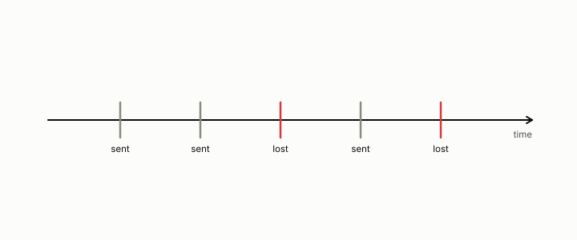

# block error rate

**id.** block-error-rate
**kind.** concept

## definition

The fraction of transmitted radio blocks the receiver cannot decode, abbreviated BLER. Chapter 13.

**Example.** Two of ten transmitted blocks undecodable is a block error rate of 0.2.

## equation

none

## conditions

- The fraction of transmitted radio blocks the receiver cannot decode, in the unit interval. A block of n symbols each lost independently with probability q fails with probability one minus one minus q to the n, at most n q, never falling as the block grows, and equal to q for a single symbol.
- The measured rates of the radio track and the refuted refresh law fit against them are the ledger's numbers, with the sealed sweep's calibrated baseline as the correction.

Conditions are curated in `entries.toml` rather than read from a record.

## ledger

none

## first stated

Chapter 13 section 13.4 of *Data Mining as Observation*, with the radio freshness track, `observation-theory-campaigns/experiments/RADIO-FRESHNESS-TRACK.md:20-35`, and the sealed sweep `observation-theory-campaigns/analysis/csi/PREREG-XPROTO-CSI-SWEEP2.md`.

## measurements

none

## failures and corrections

- [`observation-theory-campaigns/experiments/RADIO-FRESHNESS-TRACK.md:41-50`](https://github.com/ahb-sjsu/observation-theory-campaigns/blob/ddc3aad/experiments/RADIO-FRESHNESS-TRACK.md#L41-L50) at ddc3aad. **The age horizon** (`analysis/csi/`, XPROTO-CSI-SWEEP2 sealed 2026-08-27, graded PASS): at the calibrated 0.10 budget the largest compliant report period is a few TTI at 10 Hz and 1 TTI at 50 Hz and above, so there is no proportionality law to fit. The earlier `CSI-refreshfloor.*` claim of a floor ≈ 0.177·T_coh (R²=0.915) was an **unsealed exploration** measured at a relaxed 0.15 threshold against the 0.10 target, with a fresh baseline that never met the budget. It is refuted; the record is kept, not cited. Separately, the optimal linear predictor cannot beat the one-coherence-time wall (Gaussian fading → Wiener optimal), and that wall sits well outside the budget horizon. The **RAN governor** (`analysis/ran`) is the reference O-RAN rApp core: observe→measure false-clear→refresh at the floor→escalate (diversity / re-route).

## invariance envelope

none declared

## machine checked

[`lean/DataMiningAsObservation/BlockErrorRate.lean`](https://github.com/ahb-sjsu/observation-data-mining/blob/6aebdf3/lean/DataMiningAsObservation/BlockErrorRate.lean), theorems `bler_mem_unit`, `blockFail_le`, `blockFail_mono`, `blockFail_one`, `blockFail_zero`, at observation-data-mining 6aebdf3; what the check covers is stated in the book's [appendix C](https://github.com/ahb-sjsu/observation-data-mining/blob/6aebdf3/chapters/machine_checked.md).

## used in

none

## related

coherence-time, refresh-floor, freshness, false-clear-rate

## see also

Book equations stated beside the entry's terms, not defining it: 13.2, 0.25.

Ledger rows that cite the entry's records without naming it: OT-4, OT-11.

Sources-table rows that share a record with the entry without naming it: chapter 13 section 13.3, chapter 13 section 13.4.

## status

Generated 2026-09-09 by `encyclopedia/generate.py`; book at observation-data-mining 6aebdf3; the commit of every record is listed in the encyclopedia's provenance.
