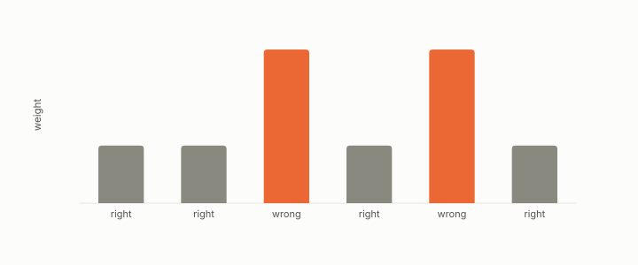

# boosting

**id.** boosting
**kind.** instrument

## definition

Fitting a sequence of weak scorers, each on the rows the previous ones got wrong, and summing them. Its step size is positive exactly when the weak scorer beats chance, and the reweighting makes the last scorer's weighted error one half. Chapter 7.

**Example.** A weak scorer with weighted error 0.25 gets step size one half of the log of 3, about 0.549, and after reweighting its error is one half.

## equation

none

## conditions

- Fitting a sequence of weak scorers, each on the rows the previous ones got wrong, and summing them with a step size set by the weighted error. The step size is positive exactly when the weak scorer beats chance, and after the rows are reweighted the weighted error of the scorer just fitted is one half, so the next scorer must find something new.
- Gradient boosting reads the loss through its curvature, so the optimizer is a consumer whose read operator is the Hessian, and on the author's five-dataset benchmark the ensemble wins when the boundary needs many features and a formula wins when it needs few.

Conditions are curated in `entries.toml` rather than read from a record.

## ledger

none

## first stated

Freund and Schapire, a decision-theoretic generalization of on-line learning, 1997, as chapter 7 section 7.1 of *Data Mining as Observation* reads it, with the curvature reader in `geometric-observation/claims/LEDGER.md` row GO-B-optim-D4.

## measurements

| Where the book states it | Numbers, as the book's sources table records them | Source |
|---|---|---|
| chapter 7 section 7.1 | bagging variance, out-of-bag estimation, random forests, importances, AdaBoost | Hastie, Tibshirani, Friedman, ESL 2e chapters 15 and 10.1; TSK 2e 4.10 |

## failures and corrections

none

## invariance envelope

none declared

## machine checked

[`lean/DataMiningAsObservation/Boosting.lean`](https://github.com/ahb-sjsu/observation-data-mining/blob/c149a10/lean/DataMiningAsObservation/Boosting.lean), theorems `alpha_pos_iff`, `alpha_half`, `reweighted_error_half`, at observation-data-mining c149a10; what the check covers is stated in the book's [appendix C](https://github.com/ahb-sjsu/observation-data-mining/blob/c149a10/chapters/machine_checked.md).

## used in

*Data Mining as Observation* chapters 1, 6, 7, 8.

## related

ensemble, curvature, decision-tree, formula-classifier, importance

## see also

Book equations stated beside the entry's terms, not defining it: 6.1, 0.8, 0.9.

Ledger rows that cite the entry's records without naming it: GO-B-optim-D4 (034 · D4).

Sources-table rows that share a record with the entry without naming it: chapter 6 section 6.3, chapter 7 section 7.2, chapter 7 section 7.3.

## status

Generated 2026-09-09 by `encyclopedia/generate.py`; book at observation-data-mining c149a10; the commit of every record is listed in the encyclopedia's provenance.
