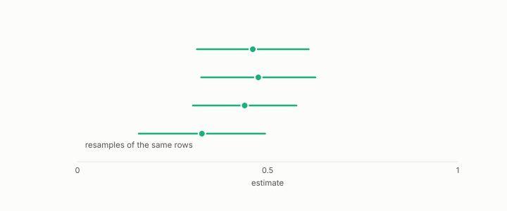

# bootstrap

**id.** bootstrap
**kind.** instrument

## definition

An estimate of a confidence interval made by resampling the data with replacement many times and recomputing the statistic each time. A paired bootstrap resamples the same rows for two methods at once so that shared sampling variation cancels. Chapter 0 section 0.9.

**Example.** Resample 100 rows with replacement 1000 times, and the spread of the 1000 means is the bootstrap standard error.

## equation

none

## conditions

- An interval estimated by resampling the data with replacement and recomputing the statistic each time. A paired bootstrap resamples the same rows for two methods at once, and the variance of the difference is the sum of the two variances minus twice their covariance, so pairing narrows the interval exactly when the two scores covary positively across rows.
- Resampling rows does not undo dependence between folds, which is the correction's job, and the bootstrap's interval is only as wide as the sample it resamples.

Conditions are curated in `entries.toml` rather than read from a record.

## ledger

none

## first stated

Efron, bootstrap methods, 1979, as chapter 0 section 0.9 states it, with the program's paired form in the flip comparisons of Volume 14 and the constraint-gap review.

## measurements

none

## failures and corrections

none

## invariance envelope

none declared

## machine checked

[`lean/DataMiningAsObservation/Bootstrap.lean`](https://github.com/ahb-sjsu/observation-data-mining/blob/95af30c/lean/DataMiningAsObservation/Bootstrap.lean), theorems `mean_sub`, `var_sub`, `paired_lt_iff`, `cov_comm`, at observation-data-mining 95af30c; what the check covers is stated in the book's [appendix C](https://github.com/ahb-sjsu/observation-data-mining/blob/95af30c/chapters/machine_checked.md).

## used in

*Data Mining as Observation* chapters 0, 6, 7, 11, 12, 14.

## related

confidence-interval, standard-error, nadeau-and-bengio-correction, harness

## see also

Book equations stated beside the entry's terms, not defining it: 8.2, 0.18.

Sources-table rows that share a record with the entry without naming it: chapter 6 section 6.4, chapter 8 section 8.5.

## status

Generated 2026-09-08 by `encyclopedia/generate.py`; book at observation-data-mining 95af30c; the commit of every record is listed in the encyclopedia's provenance.
