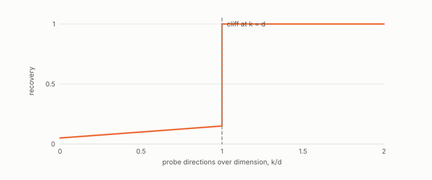

# budget cliff

**id.** budget-cliff
**kind.** result

## definition

The finding that recovery of a read operator by a probe is a cliff at the full dimension of the space rather than a slope, and that the cliff does not move with the operator's rank. Chapter 11.

**Example.** At half the dimension the probe recovered 0.366 and at the full dimension 1.000, with nothing in between reaching 0.90.

## equation

Book equation 11.4.

    \text{directions resolved}(k)=\begin{cases}1\ \text{or}\ 2,& k<d\\[2pt] \operatorname{rank}P_C,& k\ge d\end{cases}\qquad \text{cost}=2d\ \text{consumer calls per operating point}.

## conditions

- The reader receives responses confined to the k directions it chose, the read operator is planted in a fixed subspace, and noise enters as the noisy theorem models it. Under those conditions the cliff at k equal to the dimension is a theorem and is rank-independent.
- Known side information about a k0-dimensional exclusion moves the cliff to d minus k0 and never softens it.
- Whether many cheap points spread across operating points can average their way back to the population operator was measured within a budget range and is not a theorem.

Conditions are curated in `entries.toml` rather than read from a record.

## ledger

- *measures.* OT-3 `[demonstrated]`. Under subspace-confined second-order transcripts, fewer than d directions cannot identify a hidden leading eigenspace (theorem, adaptive to d−2 / oblivious to d−1); a known k₀-dim exclusion moves the cliff to exactly d−k₀ and never softens … [`geometric-observation/claims/LEDGER.md:31`](https://github.com/ahb-sjsu/geometric-observation/blob/aec4c97/claims/LEDGER.md#L31).
- *measures.* OT-10 `[**`[refuted-as-sealed]`** ⚠]`. The noisy cliff: noise floors accuracy at a derived level; the cliff's location never moves. [`geometric-observation/claims/LEDGER.md:45`](https://github.com/ahb-sjsu/geometric-observation/blob/aec4c97/claims/LEDGER.md#L45).

## first stated

readscope, predicted then measured, and proved as the confinement theorem in Volume 14, `geometric-observation/crucible/OT3-THEOREM.md` and `geometric-observation/crucible/OT3-NOISY-THEOREM.md`, DOI 10.5281/zenodo.21776291.

## measurements

| Where the book states it | Numbers, as the book's sources table records them | Source |
|---|---|---|
| chapter 11 section 11.7 | confinement theorem, side information moves the cliff to d minus k0, noisy cliff proved then measured | [`readscope/PRINCIPLES.md:112-142`](https://github.com/ahb-sjsu/readscope/blob/856e678/PRINCIPLES.md#L112-L142); [`geometric-observation/crucible/OT3-THEOREM.md`](https://github.com/ahb-sjsu/geometric-observation/blob/aec4c97/crucible/OT3-THEOREM.md); [`geometric-observation/crucible/OT3-NOISY-THEOREM.md`](https://github.com/ahb-sjsu/geometric-observation/blob/aec4c97/crucible/OT3-NOISY-THEOREM.md) |

## failures and corrections

- [`readscope/README.md:102-116`](https://github.com/ahb-sjsu/readscope/blob/856e678/README.md#L102-L116) at 856e678. What none of this changes: **the budget law, in its proven scope.** The cliff at `k = d` is a property of consumer calls, not FLOPs — a faster backend buys speed, never admission. The theorem behind it ([PRINCIPLES.md](PRINCIPLES.md), P3; OT-3) covers **subspace-confined directional designs at an operating point**, which is what this probe's per-point estimators are; it does not cover every allocation of calls across many operating points, and the sketch expectation `(1+1/k)·S + tr(S)/k·I` shares `S`'s eigenspaces at every `k` — so whether many cheap points can average their way back to the population operator was a **sample-complexity question, not a proven impossibility** — and C-15 has now measured it: at equal total consumer calls, sub-dimensional budgets do not catch up, at any graded rank, within 8× the full-dimension spend (SPEC.md, C-15). The cliff is a property of total calls in the measured range; only the far asymptotic regime remains open.

## invariance envelope

none declared

## machine checked

[`lean/DataMiningAsObservation/ProbeCliff.lean`](https://github.com/ahb-sjsu/observation-data-mining/blob/95af30c/lean/DataMiningAsObservation/ProbeCliff.lean), theorems `centralDiff_affine`, `centralDiff_basis`, `exists_blind_direction`, `indistinguishable`, `budget_cliff`, at observation-data-mining 95af30c; what the check covers is stated in the book's [appendix C](https://github.com/ahb-sjsu/observation-data-mining/blob/95af30c/chapters/machine_checked.md).

## used in

*Data Mining as Observation* chapters 1, 4, 11.

## related

blind-probe, read-operator

## see also

none

## status

Generated 2026-09-09 by `encyclopedia/generate.py`; book at observation-data-mining 95af30c; the commit of every record is listed in the encyclopedia's provenance.
