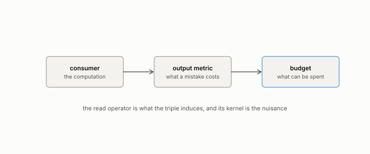

# budget

**id.** budget
**kind.** concept

## definition

The third element of an observer. The bits, rows, calls, seconds, or dollars a consumer may spend. Chapter 1.

## equation

Book equation 11.4.

    \text{directions resolved}(k)=\begin{cases}1\ \text{or}\ 2,& k<d\\[2pt] \operatorname{rank}P_C,& k\ge d\end{cases}\qquad \text{cost}=2d\ \text{consumer calls per operating point}.

## conditions

- The budget is the bits, rows, calls, seconds, or dollars a consumer may spend. It bounds what of the read operator can be measured and used, and changes the operator only when it changes the consumer.
- Comparisons are made at matched budget. A verdict at a fixed budget can invert under budget matching, and the ledger carries the case.
- For a probe the budget is consumer calls, and recovery of the read operator is a cliff at the full dimension of the space.

Conditions are curated in `entries.toml` rather than read from a record.

## ledger

- *measures.* GO-4 `[replicated]`. Fixed-budget verdicts invert under budget-matched observation, per the wavelength mechanism. [`geometric-observation/claims/LEDGER.md:66`](https://github.com/ahb-sjsu/geometric-observation/blob/d1f8988/claims/LEDGER.md#L66).

## first stated

Volume 14, chapter 4 for the triple and chapter 7 for cost, `geometric-observation/chapters/ch07_cost.md`, DOI 10.5281/zenodo.21776291.

## measurements

| Where the book states it | Numbers, as the book's sources table records them | Source |
|---|---|---|
| chapter 4 section 4.4 | GO-4 budget inversion, fixed m 10 rises, matched m 121, 126, 159 collapses, 3 seeds | [`geometric-observation/claims/LEDGER.md`](https://github.com/ahb-sjsu/geometric-observation/blob/d1f8988/claims/LEDGER.md) row GO-4 |

## failures and corrections

none

## machine checked

`lean/DataMiningAsObservation/ProbeCliff.lean`, theorems `centralDiff_affine`, `centralDiff_basis`, `exists_blind_direction`, `indistinguishable`, `budget_cliff`, at observation-data-mining 08b4794.

## used in

*Data Mining as Observation* chapters 0, 1, 2, 3, 4, 5, 6, 7, 8, 9, 10, 11, 12, 13.

## related

observer, water-filling, budget-cliff, coverage

## see also

Book equations stated beside the entry's terms, not defining it: 1.1, 0.13.

Ledger rows that cite the entry's records without naming it: OT-3, GO-12.

Sources-table rows that share a record with the entry without naming it: chapter 4 section 4.2, chapter 11 section 11.7, chapter 13 section 13.6.

## status

Generated 2026-09-06 by `encyclopedia/generate.py`; book at observation-data-mining 08b4794; the commit of every record is listed in the encyclopedia's provenance.
