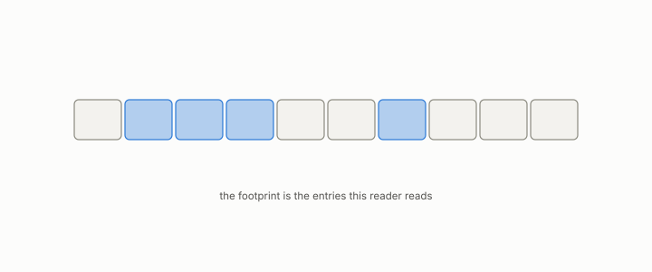

# cache

**id.** cache
**kind.** concept

## definition

A store of recently used data kept so that it need not be fetched again. A cold measurement is taken before the cache holds anything useful, a warm one after. Chapter 13.

**Example.** A cache holding 4 of a reader's 10 entries hits 40 percent of that reader's reads.

## equation

none

## conditions

- A store of recently used data kept so that it need not be fetched again. A cache reader reads the entries in its footprint and nothing else, so its hit rate over a stream of requests lies in the unit interval, is zero cold and one warm, never falls when the cache holds more, and is unchanged by entries outside the requests.
- A cold and a warm measurement of the same system are two observers of it. The ZooKeeper substrate's false-clear rate was 0.99 hot and 0.01 cold, which is the case that a cache's number is the requests' number.

Conditions are curated in `entries.toml` rather than read from a record.

## ledger

none

## first stated

Chapter 13 section 13.5 of *Data Mining as Observation*, with the cache reader row of chapter 1's consumer table and the hot-and-cold substrate measurements of the freshness track.

## measurements

none

## failures and corrections

none

## invariance envelope

none declared

## machine checked

[`lean/DataMiningAsObservation/Cache.lean`](https://github.com/ahb-sjsu/observation-data-mining/blob/95af30c/lean/DataMiningAsObservation/Cache.lean), theorems `hitRate_mem_unit`, `hitRate_cold`, `hitRate_warm`, `hitRate_mono`, `hitRate_footprint`, at observation-data-mining 95af30c; what the check covers is stated in the book's [appendix C](https://github.com/ahb-sjsu/observation-data-mining/blob/95af30c/chapters/machine_checked.md).

## used in

*Data Mining as Observation* chapters 0, 1, 2, 3, 4, 5, 6, 7, 8, 9, 10, 11, 12, 13, 14.

## related

kv-cache, eviction, freshness, replica, consumer

## see also

Book equations stated beside the entry's terms, not defining it: 13.1, 0.26.

Ledger rows that cite the entry's records without naming it: OT-11, GO-12.

Sources-table rows that share a record with the entry without naming it: chapter 8 section 8.9.

## status

Generated 2026-09-09 by `encyclopedia/generate.py`; book at observation-data-mining 95af30c; the commit of every record is listed in the encyclopedia's provenance.
