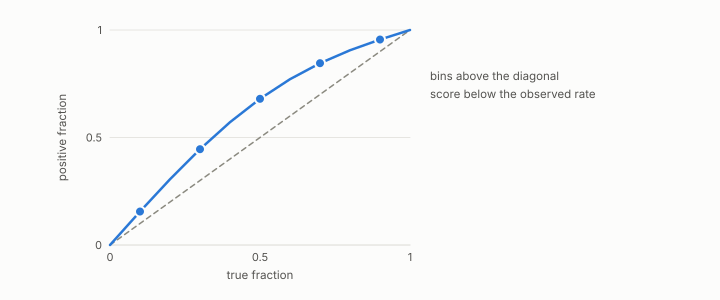

# calibration

**id.** calibration
**kind.** concept

## definition

The property of a score that a value of 0.8 means the row is positive eighty percent of the time. Measured by expected calibration error, equation 0.29.

## equation

Book equation 0.29.

    \mathrm{ECE}=\sum_b\frac{n_b}{n}\,\big|\bar s_b-\bar y_b\big|.

Book equation 0.38.

    w=\max\big(0,\ 2\cdot\mathrm{AUROC}-1\big).

## conditions

- A score is calibrated when a value of 0.8 means the row is positive eighty percent of the time. The expected calibration error, the bin-weighted mean absolute gap between mean score and fraction of positives, lies in the unit interval and is zero exactly when every weighted bin is calibrated.
- Calibration is a property of the score values and not of their ranking, so a recalibration can change it while leaving AUROC, the reliability weight, and every threshold-swept metric unchanged. The two are reported side by side and neither stands in for the other.
- Recalibrating a reconstruction toward the input improved the reconstruction and worsened the consumer, the standing negative that keeps calibration off the list of acceptance metrics for a code.

Conditions are curated in `entries.toml` rather than read from a record.

## ledger

- *refutes or corrects.* NEG-4 `[refuted]`. Lightweight online (Lloyd) key calibration beats the calibration-free default on softmax-KL. [`geometric-observation/claims/LEDGER.md:97`](https://github.com/ahb-sjsu/geometric-observation/blob/d1f8988/claims/LEDGER.md#L97).

## first stated

Chapter 0 section 0.14 of *Data Mining as Observation*, with the program's calibrated authority in `gtc-prototype/docs/CALIBRATED_AUTHORITY.md:19-63` and the recalibration negative of ledger row NEG-4.

## measurements

| Where the book states it | Numbers, as the book's sources table records them | Source |
|---|---|---|
| chapter 12 section 12.5 | ECE 0.018 to 0.101 vs raw up to 0.223, reliability weight, audit binding | `xbse/README.md:175-195`; [`gtc-prototype/docs/CALIBRATED_AUTHORITY.md:19-63`](https://github.com/ahb-sjsu/gtc-prototype/blob/328741f/docs/CALIBRATED_AUTHORITY.md#L19-L63) |
| chapter 14 section 14.2 | reliability weights and calibration errors per axis, the collapsed family's mean weight 0.559 against the general valence channel's own 0.735, the three design rules, 0.048 to 0.049 and 0.089 to 0.101 at 696 pairs | [`gtc-prototype/docs/CALIBRATED_AUTHORITY.md:1-65`](https://github.com/ahb-sjsu/gtc-prototype/blob/328741f/docs/CALIBRATED_AUTHORITY.md#L1-L65) |

## failures and corrections

- NEG-4, `[refuted]`. Lightweight online (Lloyd) key calibration beats the calibration-free default on softmax-KL. [`geometric-observation/claims/LEDGER.md:97`](https://github.com/ahb-sjsu/geometric-observation/blob/d1f8988/claims/LEDGER.md#L97).

## machine checked

`lean/DataMiningAsObservation/Calibration.lean`, theorems `ece_nonneg`, `ece_le_one`, `ece_eq_zero_iff`, `ece_of_calibrated`, at observation-data-mining 08b4794.

## used in

*Data Mining as Observation* chapters 0, 1, 2, 3, 4, 5, 6, 7, 8, 9, 10, 11, 12, 13, 14.

## related

reliability-weight, cross-corpus-gate, monotone-invariance, identity-reader

## see also

none

## status

Generated 2026-09-06 by `encyclopedia/generate.py`; book at observation-data-mining 08b4794; the commit of every record is listed in the encyclopedia's provenance.
