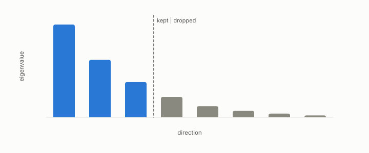

# capacity

**id.** capacity
**kind.** concept

## definition

The number of distinctions a model class can draw, the model-side half of the budget. Chapter 6.

**Example.** A formula of depth three over 18 operations can draw far fewer boundaries than a forest of 500 trees.

## equation

none

## conditions

- The number of distinctions a model class can draw, the budget's model-side half. A read operator's rank is at most the dimension, and a probe with fewer directions than the dimension cannot resolve the operator, which is the cliff.
- A formula of depth three over eighteen operations has a capacity the ensemble exceeds, and the ensemble wins exactly when the boundary needs that excess.

Conditions are curated in `entries.toml` rather than read from a record.

## ledger

none

## first stated

Chapter 6 section 6.1 of *Data Mining as Observation*, with the budget inversion in `geometric-observation/claims/LEDGER.md` row GO-4.

## measurements

none

## failures and corrections

none

## machine checked

[`lean/DataMiningAsObservation/ProbeCliff.lean`](https://github.com/ahb-sjsu/observation-data-mining/blob/08b4794/lean/DataMiningAsObservation/ProbeCliff.lean), theorems `centralDiff_affine`, `centralDiff_basis`, `exists_blind_direction`, `indistinguishable`, `budget_cliff`, at observation-data-mining 08b4794; what the check covers is stated in the book's [appendix C](https://github.com/ahb-sjsu/observation-data-mining/blob/08b4794/chapters/machine_checked.md).

[`lean/DataMiningAsObservation/Rank.lean`](https://github.com/ahb-sjsu/observation-data-mining/blob/08b4794/lean/DataMiningAsObservation/Rank.lean), theorems `rank_le_width`, `rank_le_height`, `rank_outer_le_one`, `rank_mul_le`, `rank_zero`, `rank_transpose`, at observation-data-mining 08b4794; what the check covers is stated in the book's [appendix C](https://github.com/ahb-sjsu/observation-data-mining/blob/08b4794/chapters/machine_checked.md).

## used in

*Data Mining as Observation* chapters 6, 7.

## related

budget, budget-cliff, rank, formula-classifier, ensemble

## see also

Book equations stated beside the entry's terms, not defining it: 1.1, 6.1, 11.4.

Ledger rows that cite the entry's records without naming it: GO-4.

Sources-table rows that share a record with the entry without naming it: chapter 4 section 4.4, chapter 6 section 6.3.

## status

Generated 2026-09-06 by `encyclopedia/generate.py`; book at observation-data-mining 08b4794; the commit of every record is listed in the encyclopedia's provenance.
