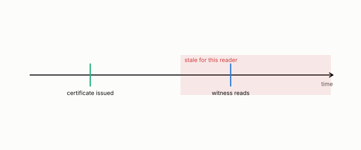

# certificate

**id.** certificate
**kind.** concept

## definition

A claim, made at a time, that something is safe to act on. A clustering, a benchmark score, a freshness guarantee, and a rank bound are all certificates. Chapters 9 and 13.

**Example.** A certificate cleared 1000 decisions and the witness disagreed on 206 of them, a false-clear rate of 0.206.

## equation

Book equation 0.26.

    \mathrm{FC}=\Pr\big[W\ \text{refutes}\ \big|\ \mathcal C_t\ \text{clears}\big],\qquad \text{coverage}=\Pr\big[\mathcal C_t\ \text{clears}\big].

Book equation 9.3.

    \hat\mu=\frac{\bar s_{\mathrm{true}}-\bar s_{\mathrm{distr}}}{\sigma_{\mathrm{distr}}},\qquad \mu_{\mathrm{crit}}=\mathbb E\Big[\max_{N-1}\mathcal N(0,1)\Big],\qquad \rho=\frac{\hat\mu}{\mu_{\mathrm{crit}}},\qquad \rho=1\ \text{vacuous}.

Book equation 11.2.

    \begin{gathered} r=\frac{d_{\mathrm{compressed}}}{d_{\mathrm{exact}}},\qquad \kappa_{\text{strict}}=\frac{\max r}{\min r},\qquad \tau\ \ge\ 1-2\hat\mu(\kappa_{\text{strict}}),\qquad \rho_S\ \ge\ 1-3\hat\mu(\kappa_{\text{strict}}), \\ \kappa_{97.5/2.5}=\frac{q_{97.5}(r)}{q_{2.5}(r)}\ \text{ gives the same two expressions as estimates, not floors.} \end{gathered}

Book equation 13.1.

    \mathrm{FC}=\Pr\big[W\ \text{refutes}\ \big|\ \mathcal C_t\ \text{clears}\big],\qquad d_O(\Delta)=\operatorname{tr}\big(P_C\,M_{\mathrm{drift}}(\Delta)\big),\qquad M_{\mathrm{drift}}(\Delta)=\mathbb E\big[\delta_\Delta\delta_\Delta^{\top}\big].

## conditions

- A certificate is graded only where a witness exists, and where none exists it is unassessed rather than safe.
- A certificate is bound to what it certified, the bytes, the anchor sample, the footprint, and the time, and carries none of it to another corpus, workload, or moment.
- A vacuous certificate proves nothing about the object. It does not prove that no code preserves rank or that no structure exists, only that this test could not certify one.
- The rank certificate's floor is a guarantee in its strict setting and an estimate in its percentile setting.

Conditions are curated in `entries.toml` rather than read from a record.

## ledger

- *measures.* GO-3 `[demonstrated]`. The certificate's vacuity threshold predicts where single-stage retrieval dies. [`geometric-observation/claims/LEDGER.md:65`](https://github.com/ahb-sjsu/geometric-observation/blob/fc6b378/claims/LEDGER.md#L65).

## first stated

Volume 14, chapter 19 for the certificate that ages and chapter 9 of *Data Mining as Observation* for the clustering certificate. The rank certificate is specified in `turboquant-pro/docs/CERTIFICATE_SPEC.md`, DOI 10.5281/zenodo.20660087.

## measurements

| Where the book states it | Numbers, as the book's sources table records them | Source |
|---|---|---|
| chapter 9 section 9.3 | the margin certificate, mu crit as the expected maximum of N minus 1 standard normals, rho, death at 0.948 within 6 percent, Spearman 0.991 vs 0.873, fourteen corpora, six gates, the v1 to v3 path, the standing correction | [`geometric-observation/experiments/GO3-certificate-vacuity-v3-NOTES.md:1-60`](https://github.com/ahb-sjsu/geometric-observation/blob/fc6b378/experiments/GO3-certificate-vacuity-v3-NOTES.md#L1-L60); [`geometric-observation/claims/LEDGER.md`](https://github.com/ahb-sjsu/geometric-observation/blob/fc6b378/claims/LEDGER.md) row GO-3 |
| chapter 13 section 13.2 | the grammar, certificate, witness, refresh floor, false-clear rate, vacuity, the witness table | [`geometric-observation/chapters/ch19_the_certificate_that_ages.md:1-95`](https://github.com/ahb-sjsu/geometric-observation/blob/fc6b378/chapters/ch19_the_certificate_that_ages.md#L1-L95); [`observation-theory-campaigns/experiments/FRESHNESS-PROGRAM.md:1-40`](https://github.com/ahb-sjsu/observation-theory-campaigns/blob/c8cd60b/experiments/FRESHNESS-PROGRAM.md#L1-L40) |

## failures and corrections

- [`observation-theory-campaigns/experiments/RADIO-FRESHNESS-TRACK.md:33-39`](https://github.com/ahb-sjsu/observation-theory-campaigns/blob/c8cd60b/experiments/RADIO-FRESHNESS-TRACK.md#L33-L39) at c8cd60b. ⚠️ **XPROTO-AICSI scope correction (2026-08-25).** The v1 seal stands for what it tested, but the reconstruction-vs-consumer dissociation does **not** survive the community-standard substrate. On real 3GPP CDL-C with a CsiNet-class codec the NMSE-optimal codec reconstructs near-perfectly (NMSE ≈ 0.03) and false-clears 0.0 on all seeds; the pre-registered kill fired. See `analysis/aicsi/PREREG-XPROTO-AICSI-V2.md` (REFUTED AT SHAKEDOWN, NOT SEALED, kept negative). This is a scope correction, not a retraction. Do not headline the AICSI row; WCNC §III-C is dropped.

## invariance envelope

none declared

## machine checked

[`lean/DataMiningAsObservation/Certificate.lean`](https://github.com/ahb-sjsu/observation-data-mining/blob/f3914f0/lean/DataMiningAsObservation/Certificate.lean), theorems `falseClear_mul_coverage`, `coverage_empty`, `falseClear_mem_unit`, `minOverStrata_passes_iff`, `minOverStrata_le_weighted_mean`, at observation-data-mining f3914f0; what the check covers is stated in the book's [appendix C](https://github.com/ahb-sjsu/observation-data-mining/blob/f3914f0/chapters/machine_checked.md).

## used in

*Data Mining as Observation* chapters 0, 1, 9, 11, 12, 13, 14.

## related

witness, false-clear-rate, coverage, rank-certificate, vacuity-threshold, coherence-time

## see also

Sources-table rows that share a record with the entry without naming it: chapter 11 section 11.3, chapter 12 section 12.6.

## status

Generated 2026-09-09 by `encyclopedia/generate.py`; book at observation-data-mining f3914f0; the commit of every record is listed in the encyclopedia's provenance.
