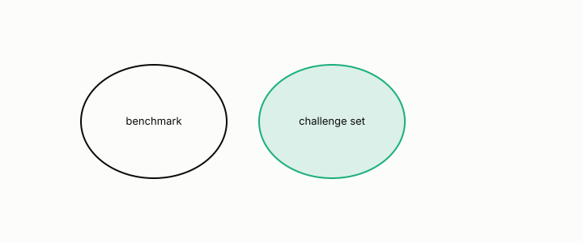

# challenge set

**id.** challenge-set
**kind.** instrument

## definition

A test collection built so that a shortcut which passes the benchmark fails on it. Chapter 12.

**Example.** The identity-attack set scored 0.237, with an interval of 0.20 to 0.28 on 289 items, while the benchmark scored 0.909.

## equation

none

## conditions

- A test collection built so that a shortcut which passes the benchmark fails on it. Every finite benchmark admits a shortcut, the lookup that returns the stored label for every benchmark row, and two scorers that agree on every benchmark row have the same benchmark error whatever they do elsewhere.
- A challenge set is any collection on which the shortcut and the intended rule disagree, which can only lie outside the benchmark, and on it the shortcut's error is positive while its benchmark error is zero.

Conditions are curated in `entries.toml` rather than read from a record.

## ledger

none

## first stated

Chapter 12 section 12.6 and chapter 14 section 14.3 of *Data Mining as Observation*, with the program's identity-attack and euphemism sets in `gtc-prototype/docs/SPECTRUM_FINDINGS.md:66-99`.

## measurements

none

## failures and corrections

none

## invariance envelope

none declared

## machine checked

[`lean/DataMiningAsObservation/ChallengeSet.lean`](https://github.com/ahb-sjsu/observation-data-mining/blob/c149a10/lean/DataMiningAsObservation/ChallengeSet.lean), theorems `shortcut_passes`, `shortcut_fails`, `benchmark_blind`, `challenge_outside`, at observation-data-mining c149a10; what the check covers is stated in the book's [appendix C](https://github.com/ahb-sjsu/observation-data-mining/blob/c149a10/chapters/machine_checked.md).

## used in

*Data Mining as Observation* chapters 0, 9, 11, 12.

## related

leakage, harness, deployment-mismatch, preregistration

## see also

Book equations stated beside the entry's terms, not defining it: 14.2, 12.3.

Ledger rows that cite the entry's records without naming it: NEG-15 (Bell boundary).

Sources-table rows that share a record with the entry without naming it: chapter 6 section 6.4, chapter 7 section 7.3, chapter 7 section 7.4, chapter 8 section 8.5.

## status

Generated 2026-09-09 by `encyclopedia/generate.py`; book at observation-data-mining c149a10; the commit of every record is listed in the encyclopedia's provenance.
