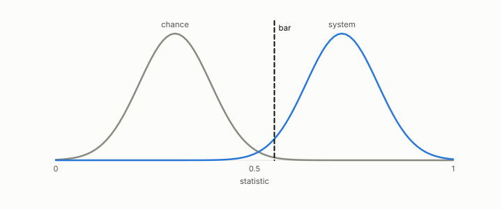

# chance level

**id.** chance-level
**kind.** concept

## definition

The value a rank statistic reaches on average under a random ranking. Zero for a correlation, one half for AUROC. Chapter 0 section 0.8.

**Example.** A constant score has AUROC 0.5, and recall at 10 from 100000 rows at random is 0.0001.

## equation

Book equation 0.38.

    w=\max\big(0,\ 2\cdot\mathrm{AUROC}-1\big).

## conditions

- The value a rank statistic reaches under a ranking that carries no information. A constant score ties every pair, so its AUROC is one half when both classes are present, its Kendall correlation with any score is zero, and its reliability weight is zero.
- Every reading the probe reports comes with its chance overlap beside it, and a gate subtracts the chance level before it counts a margin.

Conditions are curated in `entries.toml` rather than read from a record.

## ledger

none

## first stated

Chapter 0 section 0.8 of *Data Mining as Observation*, with the program's chance-overlap reporting in `readscope/readscope/metrics.py:31-99`.

## measurements

none

## failures and corrections

none

## invariance envelope

none declared

## machine checked

[`lean/DataMiningAsObservation/ChanceLevel.lean`](https://github.com/ahb-sjsu/observation-data-mining/blob/f3914f0/lean/DataMiningAsObservation/ChanceLevel.lean), theorems `aurocNum_const`, `auroc_const`, `weight_const`, `tau_const`, at observation-data-mining f3914f0; what the check covers is stated in the book's [appendix C](https://github.com/ahb-sjsu/observation-data-mining/blob/f3914f0/chapters/machine_checked.md).

## used in

*Data Mining as Observation* primer S, chapters 0, 3, 6, 11.

## related

reliability-weight, cross-corpus-gate, kendall-correlation, harness

## see also

Book equations stated beside the entry's terms, not defining it: 0.16, 0.15.

## status

Generated 2026-09-12 by `encyclopedia/generate.py`; book at observation-data-mining f3914f0; the commit of every record is listed in the encyclopedia's provenance.
