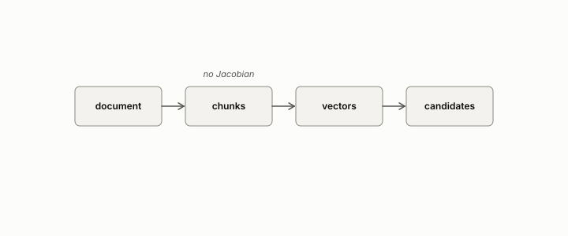

# chunk

**id.** chunk
**kind.** concept

## definition

A piece of a document, the unit a retrieval pipeline encodes and indexes. Chunking is a discrete stage with no Jacobian. Chapter 12.

**Example.** A 3000-word document cut into 500-word pieces yields six chunks, each encoded on its own.

## equation

none

## conditions

- A piece of a document, the unit a retrieval pipeline encodes and indexes. Chunking is a discrete stage with no Jacobian, and a stage that identifies two inputs identifies them for every stage after it, so what a chunker merges no later stage can separate.
- A chunk's vector is read by the index against a query vector, and the probe depth, cell, and cross-article share of the candidates are properties of the chunks and the query set together.

Conditions are curated in `entries.toml` rather than read from a record.

## ledger

none

## first stated

Chapter 12 section 12.2 of *Data Mining as Observation*, with the pullback composition in `geometric-observation/chapters/ch06_mathematical_preliminaries.md:10-27`.

## measurements

none

## failures and corrections

none

## invariance envelope

none declared

## machine checked

[`lean/DataMiningAsObservation/Pipeline.lean`](https://github.com/ahb-sjsu/observation-data-mining/blob/95af30c/lean/DataMiningAsObservation/Pipeline.lean), theorems `quotient_inherited`, `quotient_inherited_chain`, `rank_comp_le_first`, `rank_comp_le_second`, at observation-data-mining 95af30c; what the check covers is stated in the book's [appendix C](https://github.com/ahb-sjsu/observation-data-mining/blob/95af30c/chapters/machine_checked.md).

## used in

*Data Mining as Observation* chapters 0, 12.

## related

retrieval-augmented-pipeline, jacobian, pipeline, encoder, inverted-file

## see also

Book equations stated beside the entry's terms, not defining it: 12.3, 0.36.

Ledger rows that cite the entry's records without naming it: GO-B-legal (035→036).

Sources-table rows that share a record with the entry without naming it: chapter 2 section 2.2, chapter 11 section 11.4, chapter 12 section 12.2.

## status

Generated 2026-09-08 by `encyclopedia/generate.py`; book at observation-data-mining 95af30c; the commit of every record is listed in the encyclopedia's provenance.
