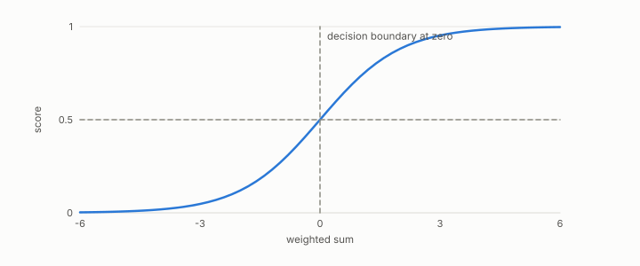

# classifier

**id.** classifier
**kind.** concept

## definition

A consumer that produces a score per row and turns it into a decision with a threshold. Chapter 6.

**Example.** A score of 0.7 against a threshold of 0.5 is a positive decision, and raising the threshold to 0.8 flips it.

## equation

Book equation 6.1.

    s(x)=w\cdot x+b,\qquad P_C=\mathbb E\big[\sigma'(s)^{2}\big]\,w\,w^{\top},\qquad \operatorname{rank}P_C=1.

## conditions

- A consumer that produces a score per row and turns it into a decision with a threshold. For a linear classifier the sensitivity is the link's slope times the weight direction, so the read operator is the workload mean of the squared slope times the outer product of the weights, sends every vector to a multiple of the weights, and reads nothing orthogonal to them.
- The score is affine, so chapter 0's exact quotient applies before the link. The whale clan classifier is the flip's classifier case, held-out AUROC 0.934 against 0.883 for a code that reconstructs twice as well.

Conditions are curated in `entries.toml` rather than read from a record.

## ledger

- *measures.* GO-B-whale (038) `[predicted]`. Sperm-whale coda dialect (DSWP/Sharma 2024), Clan classifier — cetacean communication; promotes the exploratory (A2) verdict to a sealed flip [`geometric-observation/claims/LEDGER.md:120`](https://github.com/ahb-sjsu/geometric-observation/blob/fc6b378/claims/LEDGER.md#L120).

## first stated

Chapter 6 section 6.1 of *Data Mining as Observation*, with the classifier row of Volume 14's consumer table and the whale clan classifier of ledger row GO-B-whale.

## measurements

none

## failures and corrections

none

## invariance envelope

none declared

## machine checked

[`lean/DataMiningAsObservation/Classifier.lean`](https://github.com/ahb-sjsu/observation-data-mining/blob/a0db6a8/lean/DataMiningAsObservation/Classifier.lean), theorems `readOp_classifier`, `readOp_classifier_mulVec`, `readOp_classifier_orth`, `score_orth`, at observation-data-mining a0db6a8; what the check covers is stated in the book's [appendix C](https://github.com/ahb-sjsu/observation-data-mining/blob/a0db6a8/chapters/machine_checked.md).

## used in

*Data Mining as Observation* primers L and S, chapters 0, 1, 2, 4, 5, 6, 7, 8, 10, 11, 12, 14.

## related

consumer, read-operator, threshold, decision-boundary, margin

## see also

Book equations stated beside the entry's terms, not defining it: 1.1.

Ledger rows that cite the entry's records without naming it: GO-1.

Sources-table rows that share a record with the entry without naming it: chapter 2 section 2.3, chapter 6 section 6.1.

## status

Generated 2026-09-09 by `encyclopedia/generate.py`; book at observation-data-mining a0db6a8; the commit of every record is listed in the encyclopedia's provenance.
