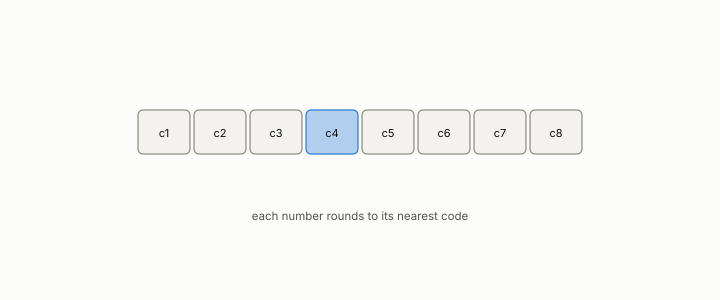

# codebook

**id.** codebook
**kind.** concept

## definition

The small set of allowed values a quantizer replaces each number with. Chapter 0 section 0.11.

**Example.** A codebook of four values, 0, 1, 2, and 3, replaces 1.4 with 1 and 2.6 with 3.

## equation

none

## conditions

- The small set of allowed values a quantizer replaces each input with, under the nearest-codeword rule. The distortion of an input is its distance to the nearest codeword, nonnegative, zero when the input is a codeword, achieved by some codeword, and never larger for a larger codebook.
- Two arms compared at unequal codebooks are not a flip comparison, which is the twenty-five percent codebook confound the ledger carries, and the reset content of a stored description is separate from its rate, which is row GO-7's finding across six codebooks.

Conditions are curated in `entries.toml` rather than read from a record.

## ledger

none

## first stated

Chapter 0 section 0.11 and chapter 4 section 4.2 of *Data Mining as Observation*, with the six codebooks of ledger row GO-7 and the codebook confound of the honest negatives.

## measurements

| Where the book states it | Numbers, as the book's sources table records them | Source |
|---|---|---|
| chapter 13 section 13.5 | GO-7, 0.67 bits per symbol, bin rate 0.26 equals 0.39, error 1.00 without side information, two families, six codebooks | [`geometric-observation/claims/LEDGER.md`](https://github.com/ahb-sjsu/geometric-observation/blob/b2626a6/claims/LEDGER.md) row GO-7 |

## failures and corrections

none

## invariance envelope

none declared

## machine checked

[`lean/DataMiningAsObservation/Codebook.lean`](https://github.com/ahb-sjsu/observation-data-mining/blob/f3914f0/lean/DataMiningAsObservation/Codebook.lean), theorems `distortion_nonneg`, `distortion_codeword`, `distortion_anti`, `exists_nearest`, at observation-data-mining f3914f0; what the check covers is stated in the book's [appendix C](https://github.com/ahb-sjsu/observation-data-mining/blob/f3914f0/chapters/machine_checked.md).

## used in

*Data Mining as Observation* chapters 0, 4, 8, 11, 13.

## related

quantization, product-quantization, confound, flip

## see also

Book equations stated beside the entry's terms, not defining it: 4.2, 0.13.

Ledger rows that cite the entry's records without naming it: GO-7, NEG-4.

Sources-table rows that share a record with the entry without naming it: chapter 4 section 4.2, chapter 4 section 4.4, chapter 6 section 6.2, chapter 7 section 7.2, chapter 9 section 9.3, chapter 11 section 11.7, chapter 12 section 12.2, chapter 12 section 12.3, chapter 13 section 13.5, chapter 13 section 13.6.

## status

Generated 2026-09-10 by `encyclopedia/generate.py`; book at observation-data-mining f3914f0; the commit of every record is listed in the encyclopedia's provenance.
