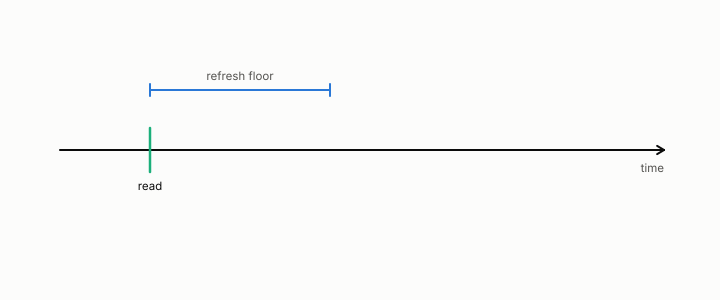

# coherence time

**id.** coherence-time
**kind.** concept

## definition

The interval over which a changing quantity stays correlated with itself. A value measured longer ago than the coherence time is a guess. Equation 0.25.

**Example.** A channel whose fading repeats every 20 milliseconds has a coherence time of 20 milliseconds.

## equation

Book equation 0.25.

    T_{\mathrm{coh}}=\frac{0.423}{f_D}.

Book equation 13.2.

    \begin{gathered} T_{\mathrm{coh}}=\frac{0.423}{f_D}, \\ \text{refuted fit:}\ \ \phi\approx0.177\,T_{\mathrm{coh}}\ (R^{2}=0.915), \qquad \text{sealed:}\ \ \phi\le 6\ \text{TTI at }10\ \text{Hz},\ \ 1\ \text{TTI at}\ \ge50\ \text{Hz}. \end{gathered}

## conditions

- Clarke's formula gives the coherence time from the Doppler frequency alone and assumes the fading model behind it.
- A value measured longer ago than the coherence time is a guess, and a certificate issued that long ago has decorrelated from the state it certified.
- The proportional refresh-floor law that was fit to it was refuted and is not cited. Its sealed replacement calibrated the baseline first and found floors at a few transmission intervals.

Conditions are curated in `entries.toml` rather than read from a record.

## ledger

none

## first stated

Clarke's model of mobile-radio reception for the formula, and Volume 14 chapter 19 for its role as the interval past which a certificate has decorrelated.

## measurements

none

## failures and corrections

- [`observation-theory-campaigns/experiments/RADIO-FRESHNESS-TRACK.md:41-50`](https://github.com/ahb-sjsu/observation-theory-campaigns/blob/f7b7c77/experiments/RADIO-FRESHNESS-TRACK.md#L41-L50) at f7b7c77. **The age horizon** (`analysis/csi/`, XPROTO-CSI-SWEEP2 sealed 2026-08-27, graded PASS): at the calibrated 0.10 budget the largest compliant report period is a few TTI at 10 Hz and 1 TTI at 50 Hz and above, so there is no proportionality law to fit. The earlier `CSI-refreshfloor.*` claim of a floor ≈ 0.177·T_coh (R²=0.915) was an **unsealed exploration** measured at a relaxed 0.15 threshold against the 0.10 target, with a fresh baseline that never met the budget. It is refuted; the record is kept, not cited. Separately, the optimal linear predictor cannot beat the one-coherence-time wall (Gaussian fading → Wiener optimal), and that wall sits well outside the budget horizon. The **RAN governor** (`analysis/ran`) is the reference O-RAN rApp core: observe→measure false-clear→refresh at the floor→escalate (diversity / re-route).

## invariance envelope

none declared

## machine checked

[`lean/DataMiningAsObservation/CoherenceTime.lean`](https://github.com/ahb-sjsu/observation-data-mining/blob/f3914f0/lean/DataMiningAsObservation/CoherenceTime.lean), theorems `clarke_to_three_decimals`, `examples`, `refuted_law_exceeds_sealed`, at observation-data-mining f3914f0; what the check covers is stated in the book's [appendix C](https://github.com/ahb-sjsu/observation-data-mining/blob/f3914f0/chapters/machine_checked.md).

## used in

*Data Mining as Observation* chapters 0, 13.

## related

certificate, false-clear-rate, refresh-floor, witness

## see also

Ledger rows that cite the entry's records without naming it: OT-4.

Sources-table rows that share a record with the entry without naming it: chapter 13 section 13.3, chapter 13 section 13.4.

## status

Generated 2026-09-10 by `encyclopedia/generate.py`; book at observation-data-mining f3914f0; the commit of every record is listed in the encyclopedia's provenance.
