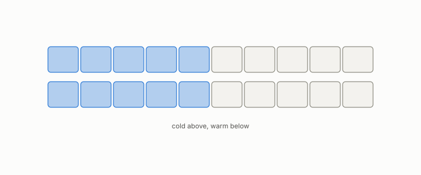

# cold, warm

**id.** cold-warm
**kind.** concept

## definition

A cold measurement is taken before the cache holds anything useful, a warm one after. A cost figure without one of the two words beside it is not a cost figure. Chapter 0 section 0.13 and chapter 13.

## equation

none

## conditions

- A cold measurement is taken before the cache holds anything useful, a warm one after. The hit rate is zero on an empty cache, one when the cache holds the whole footprint, grows as the cache grows, and does not move when entries outside the footprint are added.
- A single cold measurement at eight probes read 22.30 seconds against 0.835 seconds warm, and every previously reported placement number was warm, so a cost figure without the word warm or cold beside it is not a cost figure.

Conditions are curated in `entries.toml` rather than read from a record.

## ledger

none

## first stated

Chapter 0 section 0.13 of *Data Mining as Observation*, with the placement study's cold measurement in `turboquant-pro/docs/RESEARCH_ROADMAP.md:133-160`.

## measurements

| Where the book states it | Numbers, as the book's sources table records them | Source |
|---|---|---|
| chapter 13 section 13.1 | 22.30 s cold vs 0.835 s warm at eight probes, every prior number warm, fragmentation 63.7 bracketing 42 to 47, 64 shards, routing sparsity computed and discarded | [`turboquant-pro/docs/RESEARCH_ROADMAP.md:133-160`](https://github.com/ahb-sjsu/turboquant-pro/blob/856c4cb/docs/RESEARCH_ROADMAP.md#L133-L160) |

## failures and corrections

none

## machine checked

`lean/DataMiningAsObservation/Cache.lean`, theorems `hitRate_mem_unit`, `hitRate_cold`, `hitRate_warm`, `hitRate_mono`, `hitRate_footprint`, at observation-data-mining 08b4794.

## used in

*Data Mining as Observation* chapters 0, 1, 2, 3, 4, 5, 6, 7, 8, 9, 10, 11, 12, 13, 14.

## related

cache, eviction, replica, budget, certificate

## see also

Book equations stated beside the entry's terms, not defining it: 0.26, 13.2.

Ledger rows that cite the entry's records without naming it: OT-11, GO-12.

Sources-table rows that share a record with the entry without naming it: chapter 8 section 8.4, chapter 11 section 11.4.

## status

Generated 2026-09-06 by `encyclopedia/generate.py`; book at observation-data-mining 08b4794; the commit of every record is listed in the encyclopedia's provenance.
