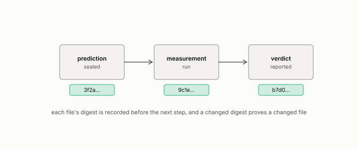

# commit hash

**id.** commit-hash
**kind.** instrument

## definition

The fingerprint git assigns to a snapshot of a repository and its history, which identifies the content exactly and does not by itself prove when it existed. Chronology comes from a public push, a signed tag, or an archival deposit. Chapter 0 section 0.12.

**Example.** Commit 3172e00 identifies one snapshot of the book's repository and every file in it, and says nothing about the clock.

## equation

none

## conditions

- The fingerprint git assigns to a snapshot of a repository together with its history. It identifies exact content, so a changed hash proves a changed file and an equal hash is strong evidence of an unchanged one, but it does not by itself prove when that content existed, since git's author and committer dates are supplied fields.
- Chronology comes from a public repository receipt, a signed tag, a transparency log, or an archival deposit such as a Zenodo DOI, and a sealed prediction names one of those beside its hash.

Conditions are curated in `entries.toml` rather than read from a record.

## ledger

none

## first stated

Chapter 0 section 0.12 of *Data Mining as Observation*, with the program's seal ledger, `observation-theory-campaigns/experiments/SEALS.md:1-10`, where every seal is a registration id, a sealing commit, and a hash.

## measurements

none

## failures and corrections

none

## invariance envelope

none declared

## machine checked

[`lean/DataMiningAsObservation/Seal.lean`](https://github.com/ahb-sjsu/observation-data-mining/blob/6aebdf3/lean/DataMiningAsObservation/Seal.lean), theorems `changed_of_hash_ne`, `hash_eq_of_eq`, `exists_collision`, at observation-data-mining 6aebdf3; what the check covers is stated in the book's [appendix C](https://github.com/ahb-sjsu/observation-data-mining/blob/6aebdf3/chapters/machine_checked.md).

## used in

*Data Mining as Observation* chapters 0, 1, 2, 3, 4, 5, 6, 7, 8, 9, 10, 11, 12, 13, 14.

## related

hash, sealed, sources-table, preregistration

## see also

Book equations stated beside the entry's terms, not defining it: 8.3.

Ledger rows that cite the entry's records without naming it: OT-7.

## status

Generated 2026-09-09 by `encyclopedia/generate.py`; book at observation-data-mining 6aebdf3; the commit of every record is listed in the encyclopedia's provenance.
