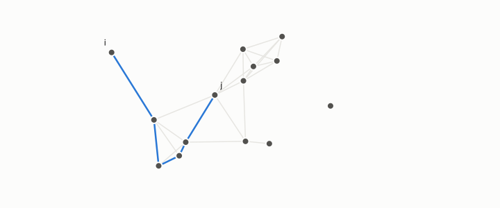

# commute time

**id.** commute-time
**kind.** concept

## definition

The expected number of steps a random walk on a graph needs to go from one node to another and back. Divided by the graph's volume it is the resistance, which a particular scaling of the spectral embedding makes equal to the squared Euclidean distance. Equation 0.20.

**Example.** On a path of three nodes the commute time between the ends is 8 steps, and dividing by the volume, 4, gives the resistance, 2.

## equation

Book equation 0.20.

    \Psi_i=\left(\frac{u_k(i)}{\sqrt{\lambda_k\,d_i}}\right)_{k\ge2},\qquad \|\Psi_i-\Psi_j\|^{2}=R(i,j)=\frac{C(i,j)}{\operatorname{vol}(G)}.

## conditions

- The expected number of steps a random walk needs to go from one node to another and back, the hitting time there plus the hitting time back, so it is symmetric and zero from a node to itself. The resistance is the commute time divided by the volume, and the squared Euclidean distance in the embedding of equation 0.20 equals the resistance, not the commute time itself.
- On a large neighbourhood graph of a shape of dimension three or more the resistance converges to one over each degree, uniformly over pairs, so it depends on two nodes only through their degrees and carries no geometry, which is why the magnitude of the spectral embedding is degree noise. The program's first claim of a commute-metric form was self-refuted, NEG-1.

Conditions are curated in `entries.toml` rather than read from a record.

## ledger

none

## first stated

Chapter 0 section 0.10 of *Data Mining as Observation*, equation 0.20, with von Luxburg, Radl, and Hein, 2014, read in chapter 3 section 3.3 and the program's collapse proof in `the-angular-observer/theorem.md:110-146`.

## measurements

| Where the book states it | Numbers, as the book's sources table records them | Source |
|---|---|---|
| chapter 3 section 3.3 | resistance converges to 1 over d_i plus 1 over d_j, simplex argument, radius converges to 1 over root d_i | `the-angular-observer/theorem.md:110-146` |

## failures and corrections

none

## invariance envelope

none declared

## machine checked

[`lean/DataMiningAsObservation/CommuteTime.lean`](https://github.com/ahb-sjsu/observation-data-mining/blob/f3914f0/lean/DataMiningAsObservation/CommuteTime.lean), theorems `commute_symm`, `commute_self`, `resistance_symm`, `commute_eq_resistance_mul`, `collapsed_congr`, `collapsed_const`, at observation-data-mining f3914f0; what the check covers is stated in the book's [appendix C](https://github.com/ahb-sjsu/observation-data-mining/blob/f3914f0/chapters/machine_checked.md).

## used in

*Data Mining as Observation* chapters 0, 3.

## related

spectral-embedding, laplacian, geodesic-distance, degree, graph

## see also

Book equations stated beside the entry's terms, not defining it: 0.19, 3.3.

Ledger rows that cite the entry's records without naming it: NEG-1.

Sources-table rows that share a record with the entry without naming it: chapter 3 section 3.3, chapter 9 section 9.1.

## status

Generated 2026-09-10 by `encyclopedia/generate.py`; book at observation-data-mining f3914f0; the commit of every record is listed in the encyclopedia's provenance.
