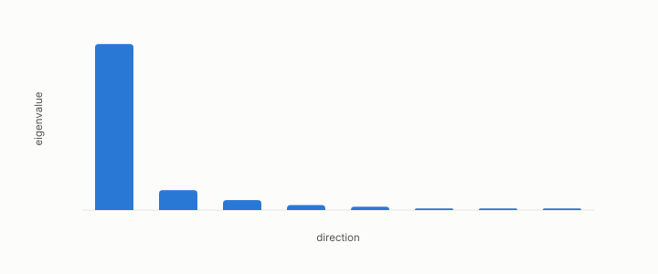

# concentrated

**id.** concentrated
**kind.** concept

## definition

Of a spectrum, having a few eigenvalues that carry most of the total. Chapter 0 section 0.4.

**Example.** A spectrum of 1.0, 0.12, 0.06, and 0.02 puts 83 percent of its total in one direction.

## equation

none

## conditions

- Of a spectrum, having a few eigenvalues that carry most of the total. If one eigenvalue carries a fraction f of the total, the effective rank is at most one over f squared, so half the mass in one direction gives effective rank at most four.
- The allocation report warns below effective rank two, which is the same statement read from the rank side, and an allocation over a concentrated spectrum spends almost everything on one direction.

Conditions are curated in `entries.toml` rather than read from a record.

## ledger

none

## first stated

Chapter 0 section 0.4 of *Data Mining as Observation*, with the allocation report's concentration caution in `turboquant-pro/turboquant_pro/read_allocation.py:244-307`.

## measurements

| Where the book states it | Numbers, as the book's sources table records them | Source |
|---|---|---|
| chapter 4 section 4.2 | allocation report, gain over uniform, concentration caution below effective rank 2 | [`turboquant-pro/turboquant_pro/read_allocation.py:244-307`](https://github.com/ahb-sjsu/turboquant-pro/blob/856c4cb/turboquant_pro/read_allocation.py#L244-L307) |

## failures and corrections

none

## machine checked

[`lean/DataMiningAsObservation/Concentrated.lean`](https://github.com/ahb-sjsu/observation-data-mining/blob/08b4794/lean/DataMiningAsObservation/Concentrated.lean), theorems `sq_le_sum_sq`, `effRank_le_of_fraction`, `effRank_le_four`, at observation-data-mining 08b4794; what the check covers is stated in the book's [appendix C](https://github.com/ahb-sjsu/observation-data-mining/blob/08b4794/chapters/machine_checked.md).

## used in

*Data Mining as Observation* chapters 0, 3, 4, 6, 10, 11, 13.

## related

spectrum, effective-rank, water-filling, isotropic

## see also

Book equations stated beside the entry's terms, not defining it: 0.7, 0.5.

Ledger rows that cite the entry's records without naming it: OT-7.

Sources-table rows that share a record with the entry without naming it: chapter 4 section 4.2.

## status

Generated 2026-09-06 by `encyclopedia/generate.py`; book at observation-data-mining 08b4794; the commit of every record is listed in the encyclopedia's provenance.
