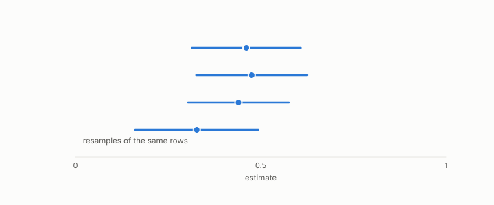

# confidence interval

**id.** confidence-interval
**kind.** concept

## definition

A range that would contain the true value in a stated fraction of repeated samples, usually 95 percent. Chapter 0 section 0.9.

**Example.** A mean of 0.62 with standard error 0.04 has a 95 percent interval of about 0.54 to 0.70.

## equation

none

## conditions

- A range that would contain the true value in a stated fraction of repeated samples. An interval with coverage one minus alpha misses in a fraction alpha, over m independent intervals the expected misses are m alpha and the chance that all cover is one minus alpha to the m, and the chance that at least one misses is at most m alpha.
- Nine intervals at ninety-five percent have a chance near seven percent of two or more misses, which is how the re-gate table's seven of nine inside the interval is read.

Conditions are curated in `entries.toml` rather than read from a record.

## ledger

none

## first stated

Chapter 0 section 0.9 of *Data Mining as Observation*, with the program's intervals in the re-gate table of chapter 14 and the hubness intervals of chapter 11.

## measurements

none

## failures and corrections

none

## invariance envelope

none declared

## machine checked

[`lean/DataMiningAsObservation/ConfidenceInterval.lean`](https://github.com/ahb-sjsu/observation-data-mining/blob/f3914f0/lean/DataMiningAsObservation/ConfidenceInterval.lean), theorems `missRate_eq`, `some_miss_le`, `nine_intervals`, `nine_expected`, at observation-data-mining f3914f0; what the check covers is stated in the book's [appendix C](https://github.com/ahb-sjsu/observation-data-mining/blob/f3914f0/chapters/machine_checked.md).

## used in

*Data Mining as Observation* primer S, chapters 0, 6, 8, 14.

## related

bootstrap, standard-error, p-value, preregistration

## see also

Book equations stated beside the entry's terms, not defining it: 8.3, 8.2.

## status

Generated 2026-09-10 by `encyclopedia/generate.py`; book at observation-data-mining f3914f0; the commit of every record is listed in the encyclopedia's provenance.
