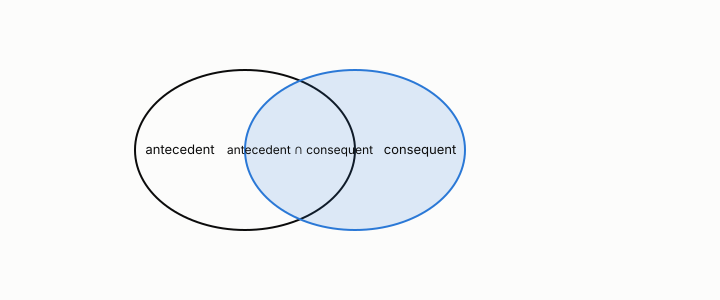

# confidence

**id.** confidence
**kind.** concept

## definition

Of a rule, the support of the rule's itemset divided by the support of its antecedent. It is not symmetric and it misleads when the consequent is common. Chapter 5.

**Example.** If 30 baskets hold bread and 24 of them also hold butter, the confidence of bread implies butter is 0.8.

## equation

Book equation 5.1.

    s(X)=\frac{\sigma(X)}{N},\qquad c(X\to Y)=\frac{\sigma(X\cup Y)}{\sigma(X)}=\frac{s(X\cup Y)}{s(X)}.

Book equation 5.2.

    \mathrm{lift}(X\to Y)=\frac{c(X\to Y)}{s(Y)}=\frac{s(X\cup Y)}{s(X)\,s(Y)}.

## conditions

- The support of a rule's itemset over the support of its antecedent, in the unit interval and not symmetric. Under independence the confidence equals the consequent's support whatever the antecedent, so a consequent in nine of ten transactions gives every rule into it confidence 0.9 with no association at all.
- Lift is confidence over the consequent's support and is one in that case, which is why chapter 5 sends rule evaluation to chapter 8's nulls.

Conditions are curated in `entries.toml` rather than read from a record.

## ledger

none

## first stated

TSK chapter 5, as chapter 5 section 5.1 of *Data Mining as Observation* states it.

## measurements

| Where the book states it | Numbers, as the book's sources table records them | Source |
|---|---|---|
| chapter 5 section 5.1 to 5.3, 5.5 | support, confidence, lift, the Apriori principle, FP-growth, closed and maximal itemsets, objective measures, Simpson's paradox, cross-support | TSK 2e chapter 5 |

## failures and corrections

none

## invariance envelope

none declared

## machine checked

[`lean/DataMiningAsObservation/Confidence.lean`](https://github.com/ahb-sjsu/observation-data-mining/blob/f3914f0/lean/DataMiningAsObservation/Confidence.lean), theorems `confidence_mem_unit`, `confidence_asymm`, `confidence_indep`, `common_consequent`, `lift_of_indep`, at observation-data-mining f3914f0; what the check covers is stated in the book's [appendix C](https://github.com/ahb-sjsu/observation-data-mining/blob/f3914f0/chapters/machine_checked.md).

## used in

*Data Mining as Observation* chapters 5, 6, 8, 9, 11, 13, 14.

## related

lift, support, itemset, multiple-comparisons

## see also

none

## status

Generated 2026-09-09 by `encyclopedia/generate.py`; book at observation-data-mining f3914f0; the commit of every record is listed in the encyclopedia's provenance.
