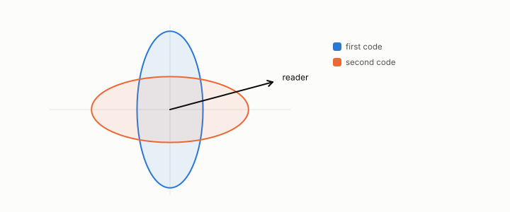

# confound

**id.** confound
**kind.** concept

## definition

A variable that moves with both the treatment and the outcome so that a measured difference cannot be attributed. Chapter 8 requires controls before a claim.

**Example.** A codebook change that arrived with a compression change moved 25 percent of the score on its own, so the comparison was confounded.

## equation

Book equation 8.3.

    \Pr[\text{at least one of } m\text{ null tests passes}]=1-(1-\alpha)^{m},\qquad \alpha_{\mathrm{Bonferroni}}=\frac{\alpha}{m}.

## conditions

- A variable that moves with both the treatment and the outcome. In the linear case the naive difference of group means is the treatment effect plus the confound's effect times the difference of the confound's means between the groups, so it equals the effect exactly when the confound is balanced or has no effect, and the bias can have either sign and any size.
- Controls come before claims. The twenty-five percent codebook confound in the flip's early arms and the smooth-perturbation control that was withdrawn are the program's cases, each carried in the ledger.

Conditions are curated in `entries.toml` rather than read from a record.

## ledger

- *refutes or corrects.* NEG-6 `[refuted]`. Relative per-channel-demeaned error norm is the quotient-tangential quantity that controls softmax-KL. [`geometric-observation/claims/LEDGER.md:99`](https://github.com/ahb-sjsu/geometric-observation/blob/0792c84/claims/LEDGER.md#L99).

## first stated

Chapter 8 section 8.6 of *Data Mining as Observation*, with the program's codebook confound in Volume 14's honest negatives and the negative controls of the constraint-gap review.

## measurements

none

## failures and corrections

- NEG-6, `[refuted]`. Relative per-channel-demeaned error norm is the quotient-tangential quantity that controls softmax-KL. [`geometric-observation/claims/LEDGER.md:99`](https://github.com/ahb-sjsu/geometric-observation/blob/0792c84/claims/LEDGER.md#L99).

## machine checked

[`lean/DataMiningAsObservation/Confound.lean`](https://github.com/ahb-sjsu/observation-data-mining/blob/95af30c/lean/DataMiningAsObservation/Confound.lean), theorems `mean_outcome`, `naive_diff`, `naive_diff_of_balanced`, `naive_diff_of_no_effect`, `bias_unbounded`, at observation-data-mining 95af30c; what the check covers is stated in the book's [appendix C](https://github.com/ahb-sjsu/observation-data-mining/blob/95af30c/chapters/machine_checked.md).

## used in

*Data Mining as Observation* chapters 2, 3, 4, 6, 7, 8, 9, 12, 13, 14.

## related

harness, null-model, simpsons-paradox, preregistration

## see also

Book equations stated beside the entry's terms, not defining it: 8.2.

Ledger rows that cite the entry's records without naming it: NEG-4, NEG-5.

Sources-table rows that share a record with the entry without naming it: chapter 8 section 8.4, chapter 8 section 8.5.

## status

Generated 2026-09-07 by `encyclopedia/generate.py`; book at observation-data-mining 95af30c; the commit of every record is listed in the encyclopedia's provenance.
