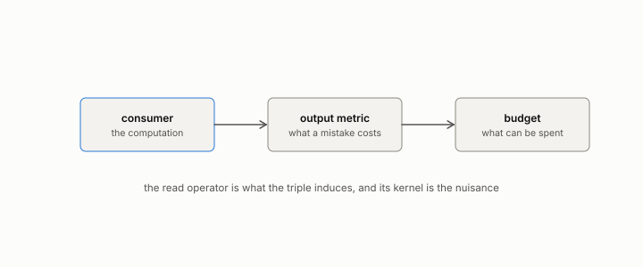

# consumer

**id.** consumer
**kind.** concept

## definition

The function that acts on a vector, the first element of an observer. A softmax, a classifier, an index, a person reading a report. Chapter 1.

**Example.** A logistic classifier reading a 30-column table is a consumer; so is a cosine ranker, and so is a person reading a summary.

## equation

Book equation 1.1.

    O=(C,\ G,\ B).

## conditions

- A consumer is any computation that takes a vector in and gives an output out, a softmax, a classifier, an index, a person reading a report. The book's quantities are functions of the consumer, and two consumers with the same read operator are not thereby the same consumer.
- A selection consumer, a tree or a threshold, has zero sensitivity almost everywhere and is read by counting where it selects rather than by finite differences.

Conditions are curated in `entries.toml` rather than read from a record.

## ledger

- *measures.* GO-1 `[predicted]`. The consumer's invariant/nuisance split is identifiable ex ante from the consumer functional. [`geometric-observation/claims/LEDGER.md:62`](https://github.com/ahb-sjsu/geometric-observation/blob/fc6b378/claims/LEDGER.md#L62).
- *measures.* GO-EC-3 `[predicted]`. A read operator recovered from a black-box consumer by query-only finite-difference probing, composed with the Kalman covariance as tr(P̂_C Σ), prospectively selects sensors that improve the held-out consumer at matched budgets with probe … [`geometric-observation/claims/LEDGER.md:162`](https://github.com/ahb-sjsu/geometric-observation/blob/fc6b378/claims/LEDGER.md#L162).

## first stated

Volume 14, chapter 4, `geometric-observation/chapters/ch04_the_observer_triple.md:9-60` and its consumer table at lines 60-135, DOI 10.5281/zenodo.21776291.

## measurements

| Where the book states it | Numbers, as the book's sources table records them | Source |
|---|---|---|
| chapter 2 section 2.3 | refusal regimes, selection consumers read order, recurrences compound | [`readscope/readscope/regimes.py:1-60`](https://github.com/ahb-sjsu/readscope/blob/856e678/readscope/regimes.py#L1-L60) |
| chapter 6 section 6.1 | the classifier row of the consumer table, the output metric makes a different observer | [`geometric-observation/chapters/ch04_the_observer_triple.md:60-135`](https://github.com/ahb-sjsu/geometric-observation/blob/fc6b378/chapters/ch04_the_observer_triple.md#L60-L135) |
| chapter 6 section 6.1 | selection consumers have zero sensitivity almost everywhere | [`readscope/readscope/regimes.py:1-60`](https://github.com/ahb-sjsu/readscope/blob/856e678/readscope/regimes.py#L1-L60) |

## failures and corrections

none

## invariance envelope

none declared

## machine checked

[`lean/DataMiningAsObservation/ReadOperator.lean`](https://github.com/ahb-sjsu/observation-data-mining/blob/f3914f0/lean/DataMiningAsObservation/ReadOperator.lean), theorems `rank_one_reads_one_direction`, `readOp_mulVec`, `quad_readOp`, `quad_readOp_nonneg`, `readOp_mulVec_eq_zero_iff`, `readOp_diag`, `readOp_offdiag`, `readOp_symm`, `readOp_neg`, `affine_const_along_nuisance`, `readOp_affine`, `readOp_sqLength_basis`, at observation-data-mining f3914f0; what the check covers is stated in the book's [appendix C](https://github.com/ahb-sjsu/observation-data-mining/blob/f3914f0/chapters/machine_checked.md).

## used in

*Data Mining as Observation* primer L, chapters 0, 1, 2, 3, 4, 5, 6, 7, 8, 9, 10, 11, 12, 13, 14.

## related

observer, read-operator, sensitivity, budget

## see also

Book equations stated beside the entry's terms, not defining it: 0.8.

Sources-table rows that share a record with the entry without naming it: chapter 1 section 1.2, chapter 6 section 6.2, chapter 11 section 11.7.

## status

Generated 2026-09-09 by `encyclopedia/generate.py`; book at observation-data-mining f3914f0; the commit of every record is listed in the encyclopedia's provenance.
