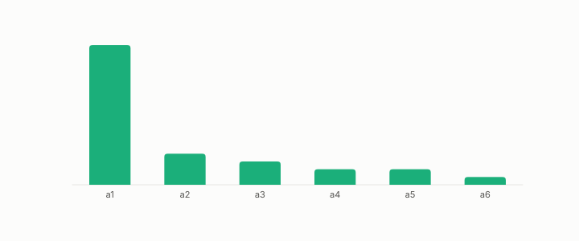

# contraction

**id.** contraction
**kind.** instrument

## definition

A formula that reduces several axes to one verdict. The instrument's contraction from ten axes is fairness minus the general valence component. Chapter 14 section 14.5.

**Example.** Ten axis scores contracted to fairness minus the general component is one number a person can read.

## equation

none

## conditions

- A formula that reduces several axes to one verdict, here ten axes to a toxicity verdict. An affine contraction has a rank-one read operator, the outer product of its weights, and its attributions sum exactly to the change in verdict.
- The contraction found by chapter 6's tool is fairness minus the general valence component, moved accuracy from 0.779 to 0.863 on 1600 items, and is a consumer a person can read.

Conditions are curated in `entries.toml` rather than read from a record.

## ledger

none

## first stated

Chapter 14 section 14.5 of *Data Mining as Observation*, with the formula in `gtc-prototype/docs/SPECTRUM_FINDINGS.md:90-99`.

## measurements

| Where the book states it | Numbers, as the book's sources table records them | Source |
|---|---|---|
| chapter 14 section 14.3 | contraction 0.779 to 0.863, 77 of 1600, 4.8 percent, 0.872 to 0.863, weight 2.69 | [`gtc-prototype/docs/SPECTRUM_FINDINGS.md:66-99`](https://github.com/ahb-sjsu/gtc-prototype/blob/c754bc5/docs/SPECTRUM_FINDINGS.md#L66-L99) |
| chapter 14 section 14.5 | the contraction formula fairness minus the general component | [`gtc-prototype/docs/SPECTRUM_FINDINGS.md:90-99`](https://github.com/ahb-sjsu/gtc-prototype/blob/c754bc5/docs/SPECTRUM_FINDINGS.md#L90-L99) |

## failures and corrections

none

## invariance envelope

none declared

## machine checked

[`lean/DataMiningAsObservation/ReadOperator.lean`](https://github.com/ahb-sjsu/observation-data-mining/blob/c149a10/lean/DataMiningAsObservation/ReadOperator.lean), theorems `rank_one_reads_one_direction`, `readOp_mulVec`, `quad_readOp`, `quad_readOp_nonneg`, `readOp_mulVec_eq_zero_iff`, `readOp_diag`, `readOp_offdiag`, `readOp_symm`, `readOp_neg`, `affine_const_along_nuisance`, `readOp_affine`, `readOp_sqLength_basis`, at observation-data-mining c149a10; what the check covers is stated in the book's [appendix C](https://github.com/ahb-sjsu/observation-data-mining/blob/c149a10/chapters/machine_checked.md).

[`lean/DataMiningAsObservation/Attribution.lean`](https://github.com/ahb-sjsu/observation-data-mining/blob/c149a10/lean/DataMiningAsObservation/Attribution.lean), theorems `attr_sum_affine`, `attr_unread`, `sq_sensitivity_eq_readOp_diag`, at observation-data-mining c149a10; what the check covers is stated in the book's [appendix C](https://github.com/ahb-sjsu/observation-data-mining/blob/c149a10/chapters/machine_checked.md).

## used in

*Data Mining as Observation* chapters 14.

## related

attribution, formula-classifier, read-operator, residualization, importance

## see also

Book equations stated beside the entry's terms, not defining it: 14.5, 0.9.

Ledger rows that cite the entry's records without naming it: GO-EC-3.

## status

Generated 2026-09-09 by `encyclopedia/generate.py`; book at observation-data-mining c149a10; the commit of every record is listed in the encyclopedia's provenance.
