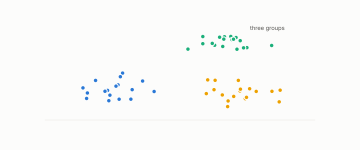

# contrastive objective

**id.** contrastive-objective
**kind.** concept

## definition

A training rule that pulls pairs declared similar together and pushes other pairs apart. The declared pairs are where an encoder learns what similar means. Chapter 12.

**Example.** Two paraphrases are pulled to cosine near one and an unrelated pair pushed toward zero, and the choice of pairs decides what the encoder can tell apart.

## equation

none

## conditions

- A training rule that pulls pairs declared similar together and pushes other pairs apart. With a margin loss the loss is nonnegative, zero exactly when every declared pair scores above every other pair by the margin, and never lower for a larger margin.
- Swapping which pairs are declared similar reverses that condition, and with a positive margin no scorer satisfies both, so the declared pairs are where an encoder learns what similar means. Fine-tuning moves the reader, and the cross-corpus positives were the fix when within-corpus scores collapsed.

Conditions are curated in `entries.toml` rather than read from a record.

## ledger

none

## first stated

Chapter 12 section 12.4 of *Data Mining as Observation*, with the program's encoders in xbse, `xbse/README.md:104-130`.

## measurements

none

## failures and corrections

none

## invariance envelope

none declared

## machine checked

[`lean/DataMiningAsObservation/Contrastive.lean`](https://github.com/ahb-sjsu/observation-data-mining/blob/f3914f0/lean/DataMiningAsObservation/Contrastive.lean), theorems `loss_nonneg`, `loss_eq_zero_iff`, `not_both`, `loss_mono_margin`, at observation-data-mining f3914f0; what the check covers is stated in the book's [appendix C](https://github.com/ahb-sjsu/observation-data-mining/blob/f3914f0/chapters/machine_checked.md).

## used in

*Data Mining as Observation* chapters 0, 11, 12.

## related

encoder, embedding, cross-corpus-gate, quotient

## see also

Book equations stated beside the entry's terms, not defining it: 12.3, 11.1.

Ledger rows that cite the entry's records without naming it: NEG-2, GO-B-legal (035→036).

Sources-table rows that share a record with the entry without naming it: chapter 12 section 12.5.

## status

Generated 2026-09-10 by `encyclopedia/generate.py`; book at observation-data-mining f3914f0; the commit of every record is listed in the encyclopedia's provenance.
