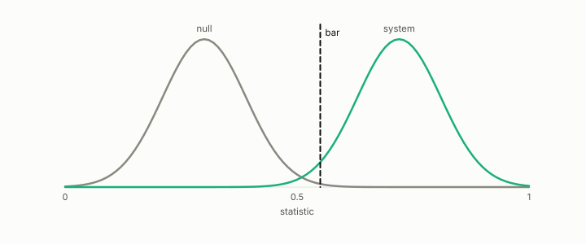

# control

**id.** control
**kind.** instrument

## definition

A comparison arm that should not show the effect, run beside the arm that should. A control that passes the bar makes the bar vacuous. Chapter 8 section 8.4.

**Example.** The first smooth-field control read 2.804 and was controlling for nothing; the second attempt read 0.184.

## equation

Book equation 8.3.

    \Pr[\text{at least one of } m\text{ null tests passes}]=1-(1-\alpha)^{m},\qquad \alpha_{\mathrm{Bonferroni}}=\frac{\alpha}{m}.

## conditions

- A comparison arm that should not show the effect, run beside the arm that should. A control that passes the bar makes the bar vacuous, so a claim names its control and reports both, and an isotropic control collapses the flip because there is no direction to read.
- The first smooth-field control read 2.804 and was controlling for nothing, because the gradient it was compared against was piecewise constant, and the second attempt read 0.184.

Conditions are curated in `entries.toml` rather than read from a record.

## ledger

none

## first stated

Chapter 8 section 8.4 of *Data Mining as Observation*, with the negative control in `constraint-gap-measurements/notes/negative_control.md:1-50`.

## measurements

| Where the book states it | Numbers, as the book's sources table records them | Source |
|---|---|---|
| chapter 4 section 4.2 | GO-6, d 8 and r 4, output at or below surrogate at or below reconstruction at every rate, about 500 times, gap 0.41 to 0.005, isotropic control collapses | [`geometric-observation/claims/LEDGER.md`](https://github.com/ahb-sjsu/geometric-observation/blob/787a933/claims/LEDGER.md) row GO-6; [`geometric-observation/chapters/ch07_cost.md`](https://github.com/ahb-sjsu/geometric-observation/blob/787a933/chapters/ch07_cost.md) |

## failures and corrections

none

## machine checked

[`lean/DataMiningAsObservation/NullModel.lean`](https://github.com/ahb-sjsu/observation-data-mining/blob/95af30c/lean/DataMiningAsObservation/NullModel.lean), theorems `card_pos_perm`, `scores_perm`, `stat_of_counts_const`, `excess_eq_zero_iff`, at observation-data-mining 95af30c; what the check covers is stated in the book's [appendix C](https://github.com/ahb-sjsu/observation-data-mining/blob/95af30c/chapters/machine_checked.md).

[`lean/DataMiningAsObservation/Bar.lean`](https://github.com/ahb-sjsu/observation-data-mining/blob/95af30c/lean/DataMiningAsObservation/Bar.lean), theorems `passes_anti`, `passes_mono`, `discriminates_iff`, `no_bar_of_null_ge`, `exists_bar_of_lt`, `vacuous_of_null_passes`, at observation-data-mining 95af30c; what the check covers is stated in the book's [appendix C](https://github.com/ahb-sjsu/observation-data-mining/blob/95af30c/chapters/machine_checked.md).

## used in

*Data Mining as Observation* chapters 2, 3, 4, 6, 7, 8, 9, 12, 13.

## related

null-model, bar, chance-level, confound, isotropic

## see also

Book equations stated beside the entry's terms, not defining it: 0.17, 4.6.

Ledger rows that cite the entry's records without naming it: GO-6, NEG-2, NEG-4.

Sources-table rows that share a record with the entry without naming it: chapter 8 section 8.4.

## status

Generated 2026-09-07 by `encyclopedia/generate.py`; book at observation-data-mining 95af30c; the commit of every record is listed in the encyclopedia's provenance.
