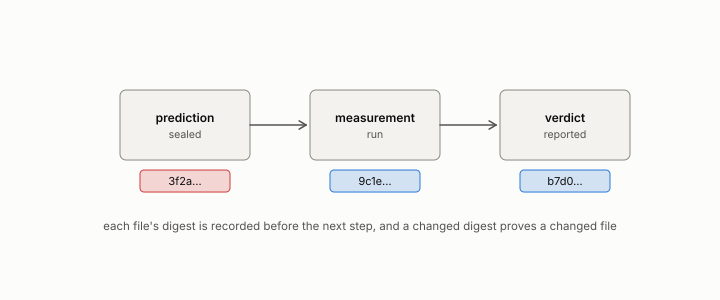

# correction

**id.** correction
**kind.** concept

## definition

An erratum or retraction, a change to a published number or claim that the record keeps beside the original, naming what was wrong and what replaced it. The Nadeau and Bengio adjustment is a statistical correction and has its own entry.

**Example.** The uncorrected t was stored as a sigma, and the corrected table changed nine wins to three, with seventeen ties.

## equation

none

## conditions

- An erratum or retraction that the record keeps beside the original. A changed digest proves a changed file, so a correction is itself a sealed object, and the rows it corrects stay visible with the correction pointing at them.
- A correction can be the wrong shape. The uncorrected t was stored as a sigma, and the fitted correction that transferred with mean absolute error zero was the identity. The rescaling of a variance for a dependence the harness ignored is a different object, the Nadeau and Bengio correction.

Conditions are curated in `entries.toml` rather than read from a record.

## ledger

none

## first stated

Chapter 2 section 2.4 and chapter 8 section 8.5 of *Data Mining as Observation*, with the standing corrections in `geometric-observation/claims/LEDGER.md`.

## measurements

| Where the book states it | Numbers, as the book's sources table records them | Source |
|---|---|---|
| chapter 6 section 6.4 | the uncorrected t stored as sigma, 251 and 15.84, nine wins to three, seven, eight, 3 wins 17 ties 11 losses on 31 datasets, the three-way inconsistency | `constraint-gap/review/FINDINGS.md:1-35`; `constraint-gap/README.md:57-76` |

## failures and corrections

none

## invariance envelope

none declared

## machine checked

[`lean/DataMiningAsObservation/Seal.lean`](https://github.com/ahb-sjsu/observation-data-mining/blob/f3914f0/lean/DataMiningAsObservation/Seal.lean), theorems `changed_of_hash_ne`, `hash_eq_of_eq`, `exists_collision`, at observation-data-mining f3914f0; what the check covers is stated in the book's [appendix C](https://github.com/ahb-sjsu/observation-data-mining/blob/f3914f0/chapters/machine_checked.md).

## used in

*Data Mining as Observation* primer S, chapters 0, 2, 3, 4, 5, 6, 7, 8, 9, 10, 11, 13, 14.

## related

nadeau-and-bengio-correction, ledger-class, sealed, harness, retraction

## see also

Ledger rows that cite the entry's records without naming it: NEG-9, NEG-13 → resolved.

Sources-table rows that share a record with the entry without naming it: chapter 6 section 6.4, chapter 6 section 6.5, chapter 8 section 8.5.

## status

Generated 2026-09-10 by `encyclopedia/generate.py`; book at observation-data-mining f3914f0; the commit of every record is listed in the encyclopedia's provenance.
